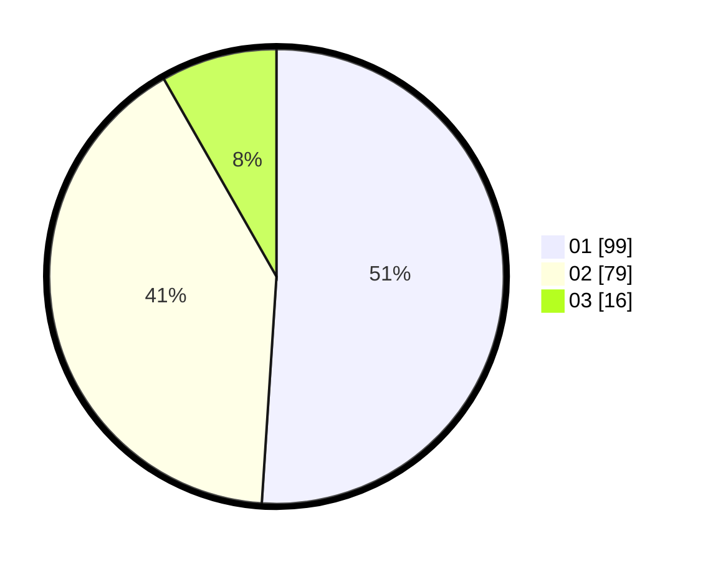

# Hasil

Hasil perolehan suara paslon dapat dilihat pada file paslon-01.txt, paslon-02.txt, dan paslon-03.txt.

Jika tidak ada, artinya data tersebut belum ada pada SIREKAP.

## Perolehan Suara

 * Paslon 01: **99**.
 * Paslon 02: **79**.
 * Paslon 03: **16**.

## Foto C Plano

https://sirekap-obj-formc.kpu.go.id/1041/pemilu/ppwp/31/73/06/10/02/3173061002156-20240214-201510--b7b1ad6c-4945-4c09-8de8-66d2b8770105.jpg

https://sirekap-obj-formc.kpu.go.id/1041/pemilu/ppwp/31/73/06/10/02/3173061002156-20240214-200617--ceb04e33-df99-4bf3-800d-ce42d0f9c60e.jpg
