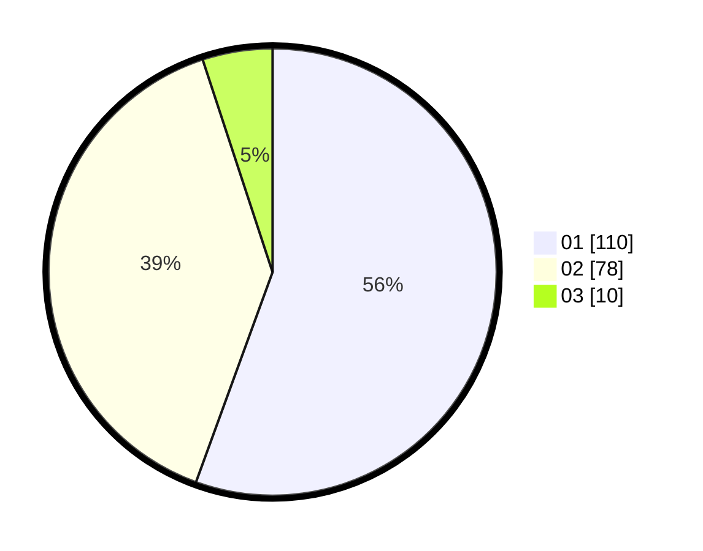

# Hasil

Hasil perolehan suara paslon dapat dilihat pada file paslon-01.txt, paslon-02.txt, dan paslon-03.txt.

Jika tidak ada, artinya data tersebut belum ada pada SIREKAP.

## Perolehan Suara

 * Paslon 01: **110**.
 * Paslon 02: **78**.
 * Paslon 03: **10**.

## Foto C Plano

https://sirekap-obj-formc.kpu.go.id/90da/pemilu/ppwp/31/73/06/10/02/3173061002157-20240214-224419--cdb7f332-42a3-4626-bc12-00629ea14e43.jpg

https://sirekap-obj-formc.kpu.go.id/90da/pemilu/ppwp/31/73/06/10/02/3173061002157-20240214-225001--adb51723-1baa-4ee6-b29b-ecbf65ca7130.jpg

https://sirekap-obj-formc.kpu.go.id/90da/pemilu/ppwp/31/73/06/10/02/3173061002157-20240214-225124--b54d9e2c-7c9e-44c3-be45-79da45e31dc8.jpg
