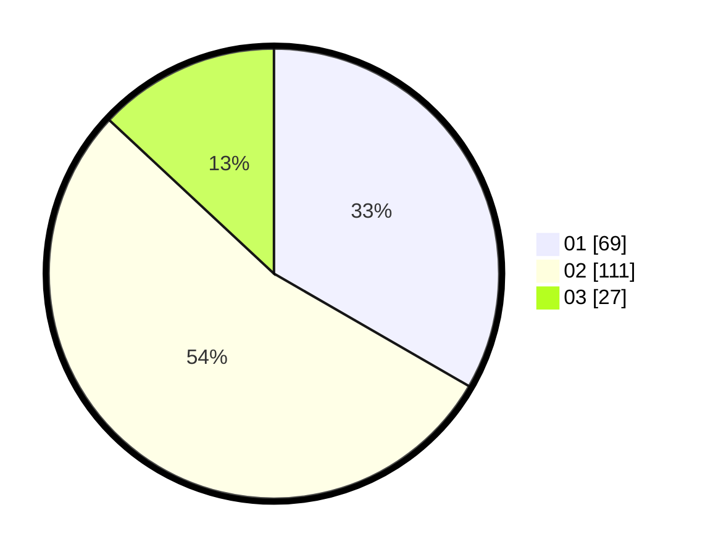

# Hasil

Hasil perolehan suara paslon dapat dilihat pada file paslon-01.txt, paslon-02.txt, dan paslon-03.txt.

Jika tidak ada, artinya data tersebut belum ada pada SIREKAP.

## Perolehan Suara

 * Paslon 01: **69**.
 * Paslon 02: **111**.
 * Paslon 03: **27**.

## Foto C Plano

https://sirekap-obj-formc.kpu.go.id/6b47/pemilu/ppwp/31/73/06/10/02/3173061002166-20240215-033455--f93eef80-1057-41ae-852e-4c7fdfbe3d36.jpg

https://sirekap-obj-formc.kpu.go.id/6b47/pemilu/ppwp/31/73/06/10/02/3173061002166-20240215-003840--69aa94ef-ef7a-4778-a501-f967080796e9.jpg

https://sirekap-obj-formc.kpu.go.id/6b47/pemilu/ppwp/31/73/06/10/02/3173061002166-20240215-003955--4fd0beca-3dfa-45ef-9179-2e2ceb5c537c.jpg
