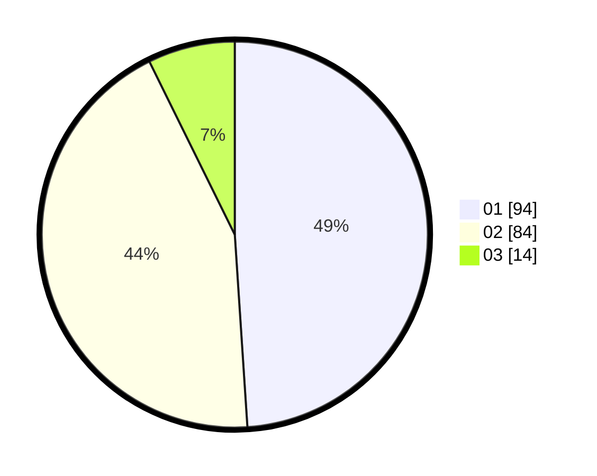

# Hasil

Hasil perolehan suara paslon dapat dilihat pada file paslon-01.txt, paslon-02.txt, dan paslon-03.txt.

Jika tidak ada, artinya data tersebut belum ada pada SIREKAP.

## Perolehan Suara

 * Paslon 01: **94**.
 * Paslon 02: **84**.
 * Paslon 03: **14**.

## Foto C Plano

https://sirekap-obj-formc.kpu.go.id/02fb/pemilu/ppwp/31/73/06/10/02/3173061002168-20240214-214204--ec5dd13a-f842-4202-b2bf-7cec1537a135.jpg

https://sirekap-obj-formc.kpu.go.id/02fb/pemilu/ppwp/31/73/06/10/02/3173061002168-20240214-214307--ff618906-36ef-4855-8b23-5034f8220f15.jpg

https://sirekap-obj-formc.kpu.go.id/02fb/pemilu/ppwp/31/73/06/10/02/3173061002168-20240214-214414--60eecd81-67dd-4b7a-8bfd-e3230a00e628.jpg
