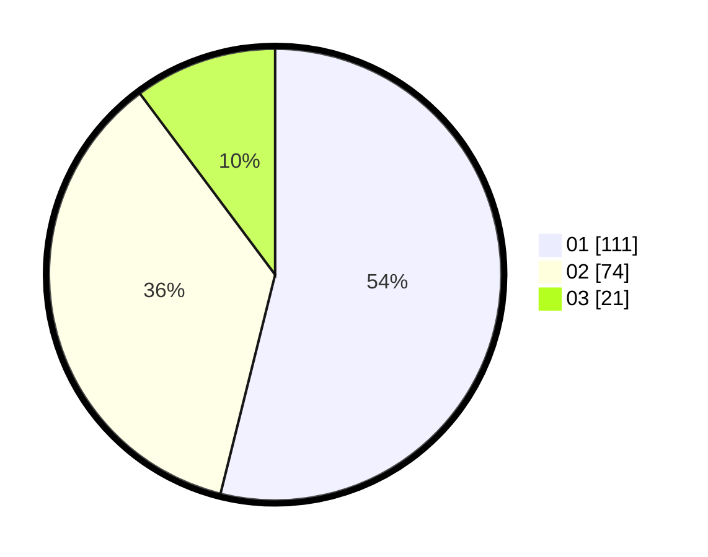

# Hasil

Hasil perolehan suara paslon dapat dilihat pada file paslon-01.txt, paslon-02.txt, dan paslon-03.txt.

Jika tidak ada, artinya data tersebut belum ada pada SIREKAP.

## Perolehan Suara

 * Paslon 01: **111**.
 * Paslon 02: **74**.
 * Paslon 03: **21**.

## Foto C Plano

https://sirekap-obj-formc.kpu.go.id/c2eb/pemilu/ppwp/31/73/06/10/02/3173061002171-20240214-190752--e3ff3cc0-35c3-4dd6-a262-698eab53f7dd.jpg

https://sirekap-obj-formc.kpu.go.id/c2eb/pemilu/ppwp/31/73/06/10/02/3173061002171-20240214-190757--360fa57d-953c-4ed0-8bdf-a26c8538a14d.jpg

https://sirekap-obj-formc.kpu.go.id/c2eb/pemilu/ppwp/31/73/06/10/02/3173061002171-20240214-190805--e53fa221-18dd-4849-b5cb-73e7d4211cc6.jpg
