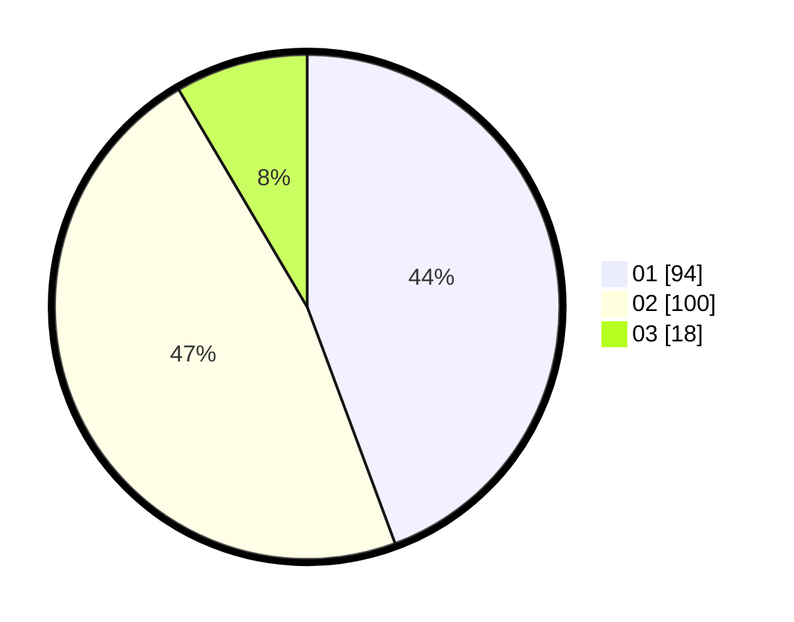

# Hasil

Hasil perolehan suara paslon dapat dilihat pada file paslon-01.txt, paslon-02.txt, dan paslon-03.txt.

Jika tidak ada, artinya data tersebut belum ada pada SIREKAP.

## Perolehan Suara

 * Paslon 01: **94**.
 * Paslon 02: **100**.
 * Paslon 03: **18**.

## Foto C Plano

https://sirekap-obj-formc.kpu.go.id/4f5b/pemilu/ppwp/31/73/06/10/02/3173061002174-20240214-185014--15a12bde-f7b2-4276-9864-c805f672b69c.jpg

https://sirekap-obj-formc.kpu.go.id/4f5b/pemilu/ppwp/31/73/06/10/02/3173061002174-20240214-185103--c0c1def6-f891-4552-ae3f-dc7ba52a24fa.jpg

https://sirekap-obj-formc.kpu.go.id/4f5b/pemilu/ppwp/31/73/06/10/02/3173061002174-20240214-185113--f767d2aa-8070-4151-8a6f-fdfc522f645f.jpg

## DATA PEMILIH TETAP

Jumlah pemilih dalam DPT: **275**.
 * L: **146**.
 * P: **129**.

## DATA PENGGUNA HAK PILIH

Jumlah pengguna hak pilih dalam DPT: **212**.
 * L: **110**.
 * P: **102**.

Jumlah pengguna hak pilih dalam DPTb: **2**.
 * L: **1**.
 * P: **1**.

Jumlah pengguna hak pilih dalam DPK: **0**.
 * L: **0**.
 * P: **0**.

Jumlah pengguna hak pilih: **214**.
 * L: **111**.
 * P: **103**.

## JUMLAH SUARA SAH DAN TIDAK SAH

JUMLAH SELURUH SUARA SAH: **212**.

JUMLAH SUARA TIDAK SAH: **2**.

JUMLAH SELURUH SUARA SAH DAN SUARA TIDAK SAH: **214**.
