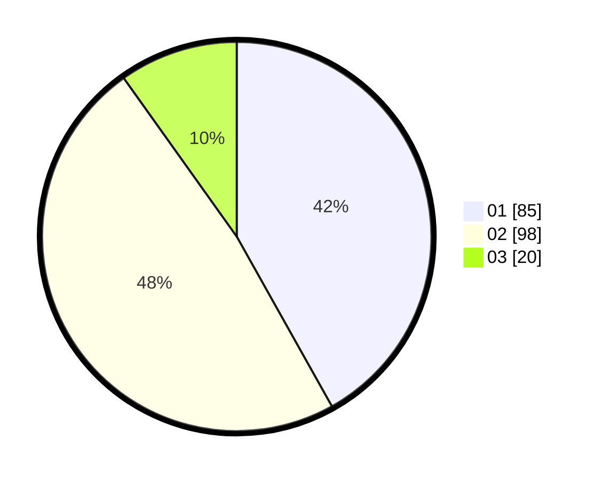

# Hasil

Hasil perolehan suara paslon dapat dilihat pada file paslon-01.txt, paslon-02.txt, dan paslon-03.txt.

Jika tidak ada, artinya data tersebut belum ada pada SIREKAP.

## Perolehan Suara

 * Paslon 01: **85**.
 * Paslon 02: **98**.
 * Paslon 03: **20**.

## Foto C Plano

https://sirekap-obj-formc.kpu.go.id/e03f/pemilu/ppwp/31/73/06/10/02/3173061002175-20240215-005145--0c48a8d8-5362-4e83-8c7f-e37a99e1fce3.jpg

https://sirekap-obj-formc.kpu.go.id/e03f/pemilu/ppwp/31/73/06/10/02/3173061002175-20240215-005111--62c2a41b-174f-46a5-b155-e25777bb9bd8.jpg

https://sirekap-obj-formc.kpu.go.id/e03f/pemilu/ppwp/31/73/06/10/02/3173061002175-20240214-212327--913833a0-3f07-4710-bc83-3813cba81f08.jpg

## DATA PEMILIH TETAP

Jumlah pemilih dalam DPT: **275**.
 * L: **142**.
 * P: **133**.

## DATA PENGGUNA HAK PILIH

Jumlah pengguna hak pilih dalam DPT: **208**.
 * L: **107**.
 * P: **101**.

Jumlah pengguna hak pilih dalam DPTb: **0**.
 * L: **0**.
 * P: **0**.

Jumlah pengguna hak pilih dalam DPK: **0**.
 * L: **0**.
 * P: **0**.

Jumlah pengguna hak pilih: **208**.
 * L: **107**.
 * P: **101**.

## JUMLAH SUARA SAH DAN TIDAK SAH

JUMLAH SELURUH SUARA SAH: **203**.

JUMLAH SUARA TIDAK SAH: **5**.

JUMLAH SELURUH SUARA SAH DAN SUARA TIDAK SAH: **208**.
