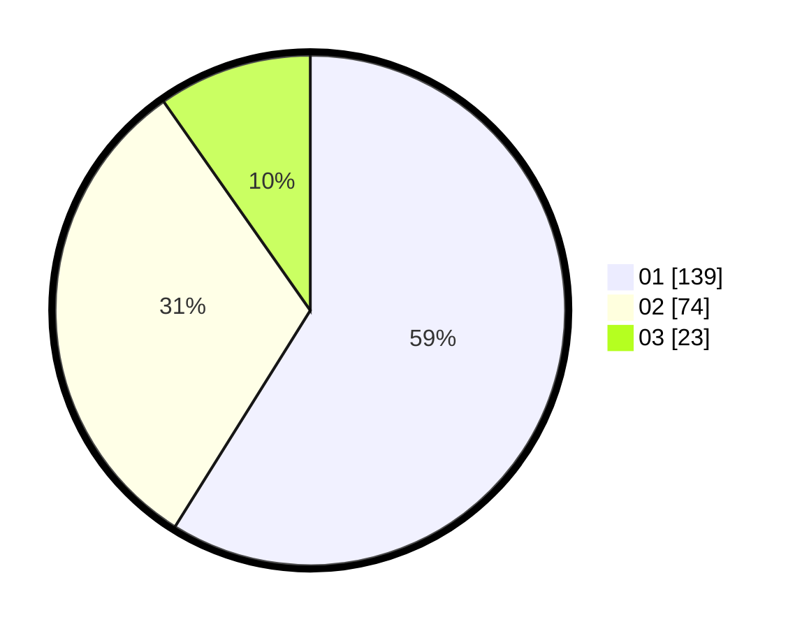

# Hasil

Hasil perolehan suara paslon dapat dilihat pada file paslon-01.txt, paslon-02.txt, dan paslon-03.txt.

Jika tidak ada, artinya data tersebut belum ada pada SIREKAP.

## Perolehan Suara

 * Paslon 01: **139**.
 * Paslon 02: **74**.
 * Paslon 03: **23**.

## Foto C Plano

https://sirekap-obj-formc.kpu.go.id/6bdb/pemilu/ppwp/31/73/06/10/02/3173061002176-20240214-214135--6eb0e6cc-6e64-4f63-807c-9dc6bc117454.jpg

https://sirekap-obj-formc.kpu.go.id/6bdb/pemilu/ppwp/31/73/06/10/02/3173061002176-20240214-214141--320d4fd1-749b-4260-9f95-bf16863f1948.jpg

https://sirekap-obj-formc.kpu.go.id/6bdb/pemilu/ppwp/31/73/06/10/02/3173061002176-20240214-214146--6251b983-1fb5-4dd0-bc9a-391cb0b1a537.jpg

## DATA PEMILIH TETAP

Jumlah pemilih dalam DPT: **241**.
 * L: **111**.
 * P: **130**.

## DATA PENGGUNA HAK PILIH

Jumlah pengguna hak pilih dalam DPT: **235**.
 * L: **108**.
 * P: **127**.

Jumlah pengguna hak pilih dalam DPTb: **0**.
 * L: **0**.
 * P: **0**.

Jumlah pengguna hak pilih dalam DPK: **6**.
 * L: **3**.
 * P: **3**.

Jumlah pengguna hak pilih: **241**.
 * L: **111**.
 * P: **130**.

## JUMLAH SUARA SAH DAN TIDAK SAH

JUMLAH SELURUH SUARA SAH: **236**.

JUMLAH SUARA TIDAK SAH: **5**.

JUMLAH SELURUH SUARA SAH DAN SUARA TIDAK SAH: **241**.
