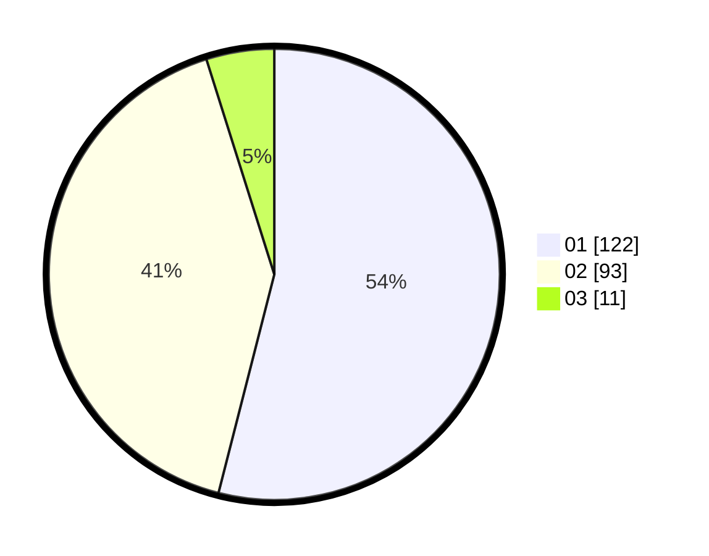

# Hasil

Hasil perolehan suara paslon dapat dilihat pada file paslon-01.txt, paslon-02.txt, dan paslon-03.txt.

Jika tidak ada, artinya data tersebut belum ada pada SIREKAP.

## Perolehan Suara

 * Paslon 01: **122**.
 * Paslon 02: **93**.
 * Paslon 03: **11**.

## Foto C Plano

https://sirekap-obj-formc.kpu.go.id/3a6e/pemilu/ppwp/31/73/06/10/02/3173061002177-20240215-021827--b88c7cbe-304d-4518-ae74-395bb0acc4bb.jpg

https://sirekap-obj-formc.kpu.go.id/3a6e/pemilu/ppwp/31/73/06/10/02/3173061002177-20240215-021933--8ecc3024-8b22-4b9a-88aa-3292ad27fd72.jpg

https://sirekap-obj-formc.kpu.go.id/3a6e/pemilu/ppwp/31/73/06/10/02/3173061002177-20240215-022202--c948191b-8f71-4618-8cc0-dff4a9ec300b.jpg

## DATA PEMILIH TETAP

Jumlah pemilih dalam DPT: **268**.
 * L: **138**.
 * P: **130**.

## DATA PENGGUNA HAK PILIH

Jumlah pengguna hak pilih dalam DPT: **227**.
 * L: **115**.
 * P: **112**.

Jumlah pengguna hak pilih dalam DPTb: **5**.
 * L: **4**.
 * P: **1**.

Jumlah pengguna hak pilih dalam DPK: **1**.
 * L: **0**.
 * P: **1**.

Jumlah pengguna hak pilih: **233**.
 * L: **119**.
 * P: **114**.

## JUMLAH SUARA SAH DAN TIDAK SAH

JUMLAH SELURUH SUARA SAH: **226**.

JUMLAH SUARA TIDAK SAH: **7**.

JUMLAH SELURUH SUARA SAH DAN SUARA TIDAK SAH: **233**.
