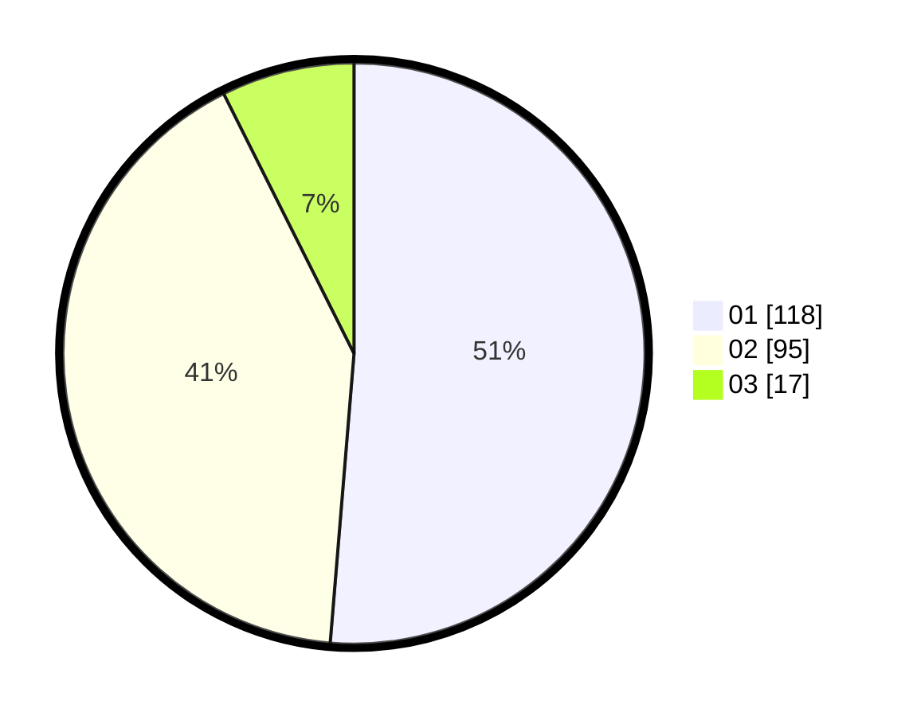

# Hasil

Hasil perolehan suara paslon dapat dilihat pada file paslon-01.txt, paslon-02.txt, dan paslon-03.txt.

Jika tidak ada, artinya data tersebut belum ada pada SIREKAP.

## Perolehan Suara

 * Paslon 01: **118**.
 * Paslon 02: **95**.
 * Paslon 03: **17**.

## Foto C Plano

https://sirekap-obj-formc.kpu.go.id/8043/pemilu/ppwp/31/73/06/10/02/3173061002178-20240215-001940--94f6f119-d1f5-4ed7-a0ce-ae077e6c484c.jpg

https://sirekap-obj-formc.kpu.go.id/8043/pemilu/ppwp/31/73/06/10/02/3173061002178-20240216-143507--e28c4a15-a1d9-4a6d-91df-203e1207df67.jpg

https://sirekap-obj-formc.kpu.go.id/8043/pemilu/ppwp/31/73/06/10/02/3173061002178-20240215-002113--f524b88c-544c-4afe-9de2-1f7ea55a1153.jpg

## DATA PEMILIH TETAP

Jumlah pemilih dalam DPT: **270**.
 * L: **130**.
 * P: **142**.

## DATA PENGGUNA HAK PILIH

Jumlah pengguna hak pilih dalam DPT: **212**.
 * L: **105**.
 * P: **100**.

Jumlah pengguna hak pilih dalam DPTb: **300**.
 * L: **2**.
 * P: **70**.

Jumlah pengguna hak pilih dalam DPK: **0**.
 * L: **0**.
 * P: **0**.

Jumlah pengguna hak pilih: **231**.
 * L: **107**.
 * P: **124**.

## JUMLAH SUARA SAH DAN TIDAK SAH

JUMLAH SELURUH SUARA SAH: **230**.

JUMLAH SUARA TIDAK SAH: **5**.

JUMLAH SELURUH SUARA SAH DAN SUARA TIDAK SAH: **235**.
