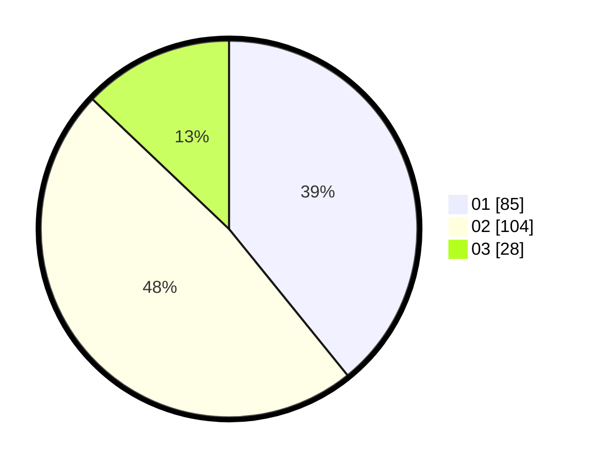

# Hasil

Hasil perolehan suara paslon dapat dilihat pada file paslon-01.txt, paslon-02.txt, dan paslon-03.txt.

Jika tidak ada, artinya data tersebut belum ada pada SIREKAP.

## Perolehan Suara

 * Paslon 01: **85**.
 * Paslon 02: **104**.
 * Paslon 03: **28**.

## Foto C Plano

https://sirekap-obj-formc.kpu.go.id/7dfd/pemilu/ppwp/31/73/06/10/02/3173061002191-20240214-233748--18cce596-911a-47e5-b9f0-bcf5501ac891.jpg

https://sirekap-obj-formc.kpu.go.id/7dfd/pemilu/ppwp/31/73/06/10/02/3173061002191-20240214-233834--870dda03-9dcb-4ee0-8930-39812514ff77.jpg

https://sirekap-obj-formc.kpu.go.id/7dfd/pemilu/ppwp/31/73/06/10/02/3173061002191-20240214-233932--9a95f766-a1e2-4808-be7e-eecc628b6a0a.jpg
