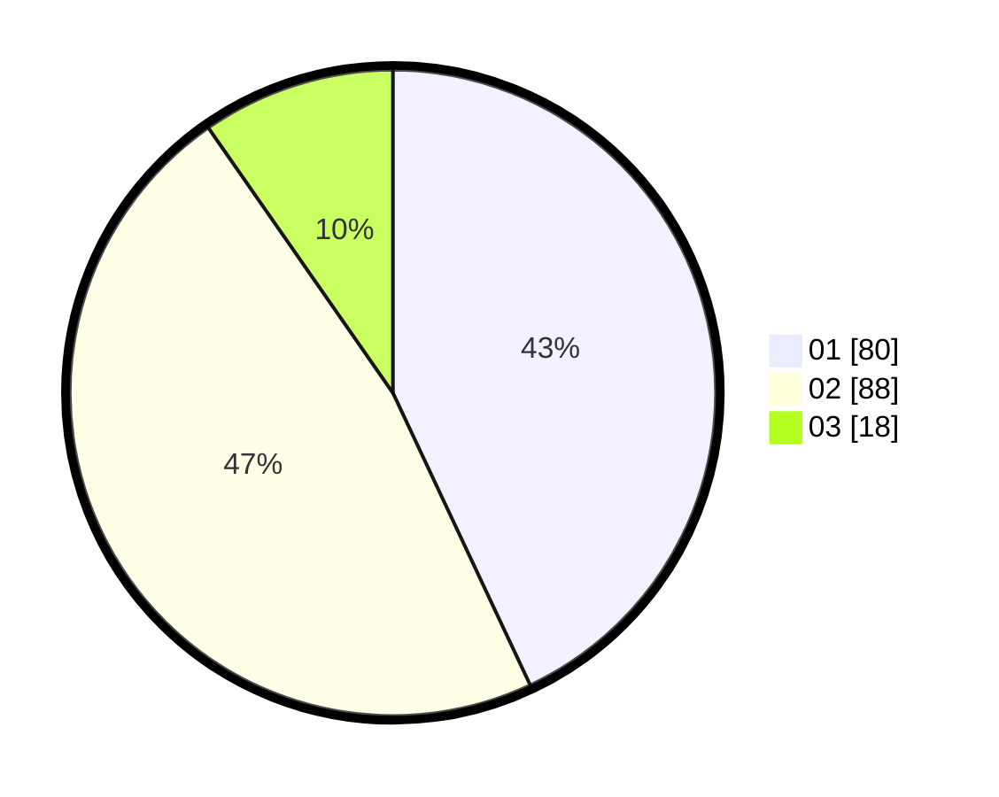

# Hasil

Hasil perolehan suara paslon dapat dilihat pada file paslon-01.txt, paslon-02.txt, dan paslon-03.txt.

Jika tidak ada, artinya data tersebut belum ada pada SIREKAP.

## Perolehan Suara

 * Paslon 01: **80**.
 * Paslon 02: **88**.
 * Paslon 03: **18**.

## Foto C Plano

https://sirekap-obj-formc.kpu.go.id/26eb/pemilu/ppwp/31/73/06/10/02/3173061002192-20240214-231945--ca6be76e-33e2-46cc-a853-b4a63e26fbbe.jpg

https://sirekap-obj-formc.kpu.go.id/26eb/pemilu/ppwp/31/73/06/10/02/3173061002192-20240214-232008--7713ffde-4730-4530-8658-bd819f6b9296.jpg

https://sirekap-obj-formc.kpu.go.id/26eb/pemilu/ppwp/31/73/06/10/02/3173061002192-20240214-232033--d21e1c94-f4d7-49db-ab78-76f57037723e.jpg
