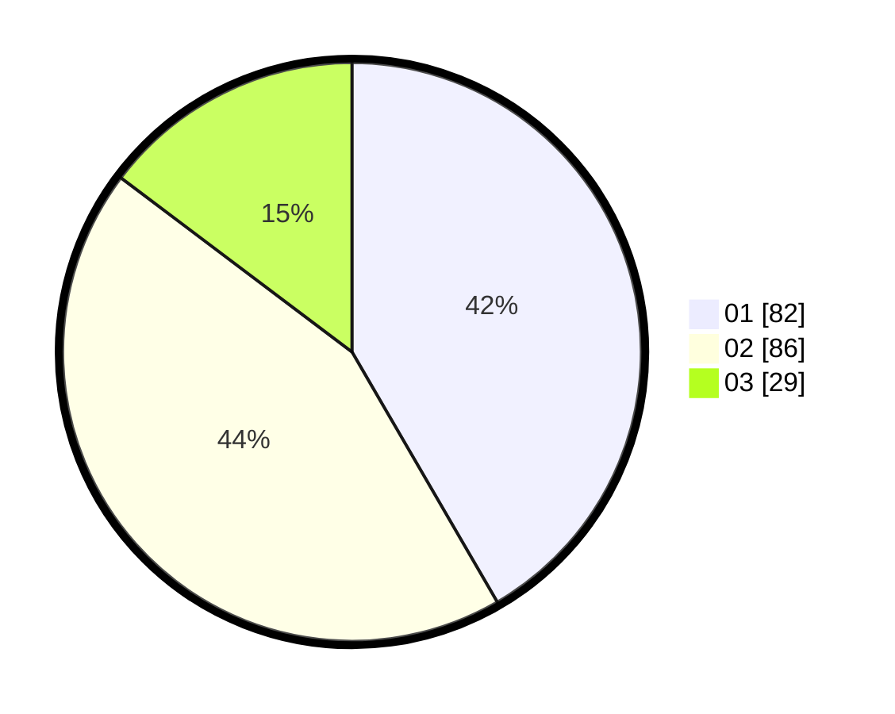

# Hasil

Hasil perolehan suara paslon dapat dilihat pada file paslon-01.txt, paslon-02.txt, dan paslon-03.txt.

Jika tidak ada, artinya data tersebut belum ada pada SIREKAP.

## Perolehan Suara

 * Paslon 01: **82**.
 * Paslon 02: **86**.
 * Paslon 03: **29**.

## Foto C Plano

https://sirekap-obj-formc.kpu.go.id/1bd8/pemilu/ppwp/31/73/06/10/02/3173061002195-20240214-223220--86a8eb58-ba7f-4977-841b-bd512f632f01.jpg

https://sirekap-obj-formc.kpu.go.id/1bd8/pemilu/ppwp/31/73/06/10/02/3173061002195-20240214-222148--7e4ed621-887c-4b80-adb8-a2f78700d58b.jpg

https://sirekap-obj-formc.kpu.go.id/1bd8/pemilu/ppwp/31/73/06/10/02/3173061002195-20240214-222317--212207fd-5b5d-407d-8357-9882564dc6cc.jpg
