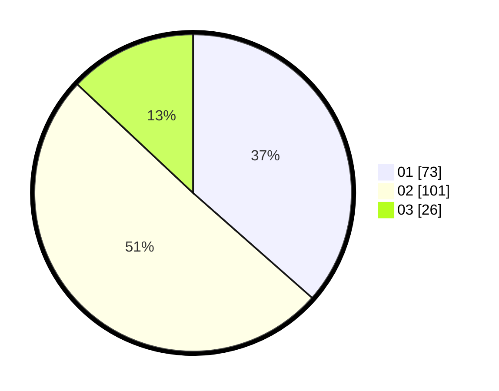

# Hasil

Hasil perolehan suara paslon dapat dilihat pada file paslon-01.txt, paslon-02.txt, dan paslon-03.txt.

Jika tidak ada, artinya data tersebut belum ada pada SIREKAP.

## Perolehan Suara

 * Paslon 01: **73**.
 * Paslon 02: **101**.
 * Paslon 03: **26**.

## Foto C Plano

https://sirekap-obj-formc.kpu.go.id/cc16/pemilu/ppwp/31/73/06/10/02/3173061002196-20240214-155507--56122057-7ce7-49c2-afe9-5198fa249969.jpg

https://sirekap-obj-formc.kpu.go.id/cc16/pemilu/ppwp/31/73/06/10/02/3173061002196-20240214-155732--1b18f517-1e94-4af6-a5f8-5f20552e9538.jpg

https://sirekap-obj-formc.kpu.go.id/cc16/pemilu/ppwp/31/73/06/10/02/3173061002196-20240214-193030--789509cf-45d9-4dca-a80c-c87837b6be61.jpg

## DATA PEMILIH TETAP

Jumlah pemilih dalam DPT: **269**.
 * L: **137**.
 * P: **132**.

## DATA PENGGUNA HAK PILIH

Jumlah pengguna hak pilih dalam DPT: **198**.
 * L: **100**.
 * P: **98**.

Jumlah pengguna hak pilih dalam DPTb: **3**.
 * L: **2**.
 * P: **1**.

Jumlah pengguna hak pilih dalam DPK: **1**.
 * L: **0**.
 * P: **1**.

Jumlah pengguna hak pilih: **202**.
 * L: **102**.
 * P: **100**.

## JUMLAH SUARA SAH DAN TIDAK SAH

JUMLAH SELURUH SUARA SAH: **200**.

JUMLAH SUARA TIDAK SAH: **2**.

JUMLAH SELURUH SUARA SAH DAN SUARA TIDAK SAH: **202**.
