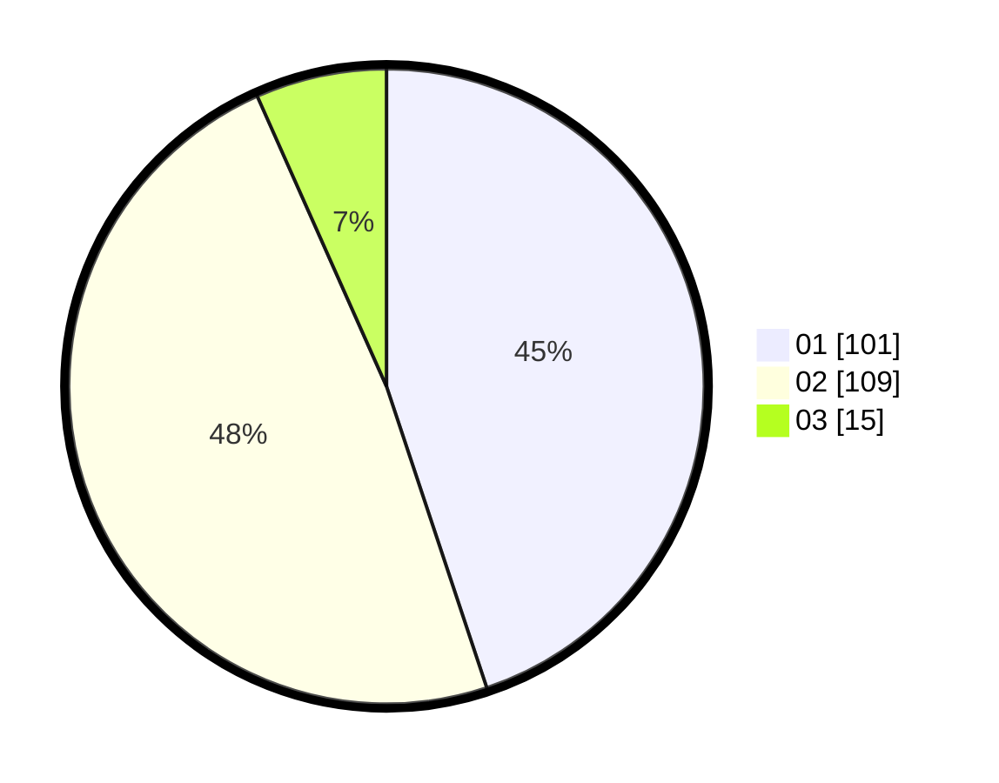

# Hasil

Hasil perolehan suara paslon dapat dilihat pada file paslon-01.txt, paslon-02.txt, dan paslon-03.txt.

Jika tidak ada, artinya data tersebut belum ada pada SIREKAP.

## Perolehan Suara

 * Paslon 01: **101**.
 * Paslon 02: **109**.
 * Paslon 03: **15**.

## Foto C Plano

https://sirekap-obj-formc.kpu.go.id/4705/pemilu/ppwp/31/73/06/10/02/3173061002198-20240214-205238--ff8cde2b-5ef1-4b59-9528-c6e70d819e44.jpg

https://sirekap-obj-formc.kpu.go.id/4705/pemilu/ppwp/31/73/06/10/02/3173061002198-20240214-185500--df880899-db18-49a6-a89a-d45e2ad9d9e2.jpg
