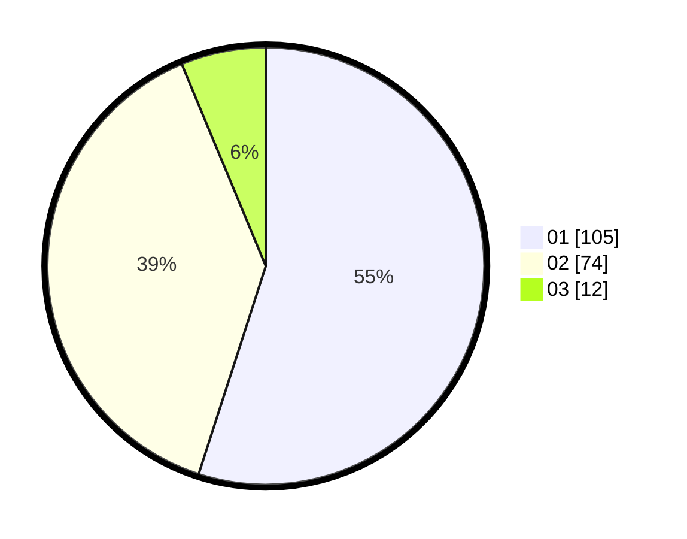

# Hasil

Hasil perolehan suara paslon dapat dilihat pada file paslon-01.txt, paslon-02.txt, dan paslon-03.txt.

Jika tidak ada, artinya data tersebut belum ada pada SIREKAP.

## Perolehan Suara

 * Paslon 01: **105**.
 * Paslon 02: **74**.
 * Paslon 03: **12**.

## Foto C Plano

https://sirekap-obj-formc.kpu.go.id/f11e/pemilu/ppwp/31/73/06/10/02/3173061002204-20240214-211429--e1340f21-b9b4-4e08-8a07-c1ad9548eaf8.jpg

https://sirekap-obj-formc.kpu.go.id/f11e/pemilu/ppwp/31/73/06/10/02/3173061002204-20240214-211934--b8b97be4-0dc9-4e74-a996-0e1e3e662f7d.jpg

https://sirekap-obj-formc.kpu.go.id/f11e/pemilu/ppwp/31/73/06/10/02/3173061002204-20240214-211550--ba2832e8-aaf4-4b20-a432-3835749d9f23.jpg

## DATA PEMILIH TETAP

Jumlah pemilih dalam DPT: **255**.
 * L: **120**.
 * P: **135**.

## DATA PENGGUNA HAK PILIH

Jumlah pengguna hak pilih dalam DPT: **196**.
 * L: **90**.
 * P: **106**.

Jumlah pengguna hak pilih dalam DPTb: **0**.
 * L: **0**.
 * P: **0**.

Jumlah pengguna hak pilih dalam DPK: **0**.
 * L: **0**.
 * P: **0**.

Jumlah pengguna hak pilih: **196**.
 * L: **90**.
 * P: **106**.

## JUMLAH SUARA SAH DAN TIDAK SAH

JUMLAH SELURUH SUARA SAH: **191**.

JUMLAH SUARA TIDAK SAH: **5**.

JUMLAH SELURUH SUARA SAH DAN SUARA TIDAK SAH: **196**.
