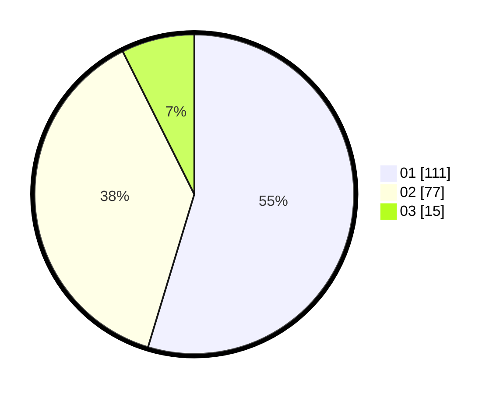

# Hasil

Hasil perolehan suara paslon dapat dilihat pada file paslon-01.txt, paslon-02.txt, dan paslon-03.txt.

Jika tidak ada, artinya data tersebut belum ada pada SIREKAP.

## Perolehan Suara

 * Paslon 01: **111**.
 * Paslon 02: **77**.
 * Paslon 03: **15**.

## Foto C Plano

https://sirekap-obj-formc.kpu.go.id/5dcd/pemilu/ppwp/31/73/06/10/02/3173061002205-20240216-145421--26f0989a-a54b-447d-a917-7a1bb7f89131.jpg

https://sirekap-obj-formc.kpu.go.id/5dcd/pemilu/ppwp/31/73/06/10/02/3173061002205-20240216-145422--024462c1-9773-4411-a485-1e3b7341ab5a.jpg

https://sirekap-obj-formc.kpu.go.id/5dcd/pemilu/ppwp/31/73/06/10/02/3173061002205-20240216-145422--7920f4c8-dce1-4729-84f0-aaffeab4171d.jpg

## DATA PEMILIH TETAP

Jumlah pemilih dalam DPT: **254**.
 * L: **122**.
 * P: **132**.

## DATA PENGGUNA HAK PILIH

Jumlah pengguna hak pilih dalam DPT: **208**.
 * L: **97**.
 * P: **111**.

Jumlah pengguna hak pilih dalam DPTb: **0**.
 * L: **0**.
 * P: **0**.

Jumlah pengguna hak pilih dalam DPK: **0**.
 * L: **0**.
 * P: **0**.

Jumlah pengguna hak pilih: **208**.
 * L: **97**.
 * P: **111**.

## JUMLAH SUARA SAH DAN TIDAK SAH

JUMLAH SELURUH SUARA SAH: **203**.

JUMLAH SUARA TIDAK SAH: **5**.

JUMLAH SELURUH SUARA SAH DAN SUARA TIDAK SAH: **208**.
