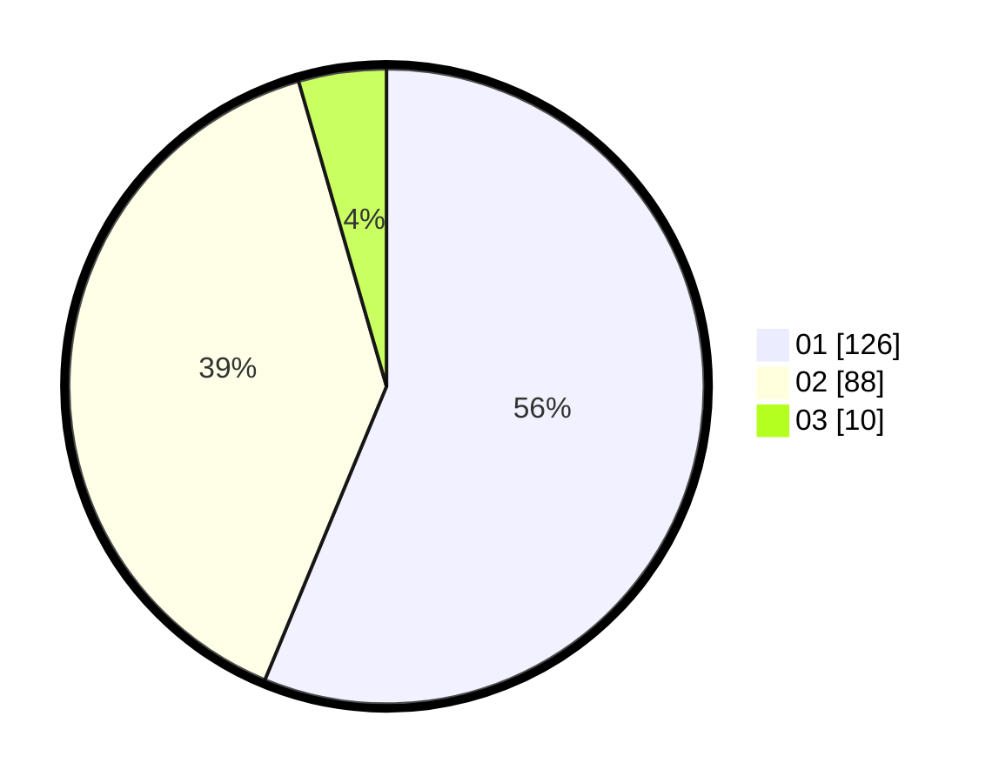

# Hasil

Hasil perolehan suara paslon dapat dilihat pada file paslon-01.txt, paslon-02.txt, dan paslon-03.txt.

Jika tidak ada, artinya data tersebut belum ada pada SIREKAP.

## Perolehan Suara

 * Paslon 01: **126**.
 * Paslon 02: **88**.
 * Paslon 03: **10**.

## Foto C Plano

https://sirekap-obj-formc.kpu.go.id/a18b/pemilu/ppwp/31/73/06/10/02/3173061002206-20240214-155341--57fec9ac-7ba2-4513-b36d-15ead59facd9.jpg

https://sirekap-obj-formc.kpu.go.id/a18b/pemilu/ppwp/31/73/06/10/02/3173061002206-20240214-155214--71e32cf8-f8e6-4c0f-ad7a-a4b8ed575361.jpg

https://sirekap-obj-formc.kpu.go.id/a18b/pemilu/ppwp/31/73/06/10/02/3173061002206-20240214-155443--0015ae25-8f4a-40e7-a3dd-047de99f9185.jpg

## DATA PEMILIH TETAP

Jumlah pemilih dalam DPT: **279**.
 * L: **140**.
 * P: **139**.

## DATA PENGGUNA HAK PILIH

Jumlah pengguna hak pilih dalam DPT: **225**.
 * L: **112**.
 * P: **113**.

Jumlah pengguna hak pilih dalam DPTb: **0**.
 * L: **0**.
 * P: **0**.

Jumlah pengguna hak pilih dalam DPK: **2**.
 * L: **1**.
 * P: **1**.

Jumlah pengguna hak pilih: **227**.
 * L: **113**.
 * P: **114**.

## JUMLAH SUARA SAH DAN TIDAK SAH

JUMLAH SELURUH SUARA SAH: **224**.

JUMLAH SUARA TIDAK SAH: **3**.

JUMLAH SELURUH SUARA SAH DAN SUARA TIDAK SAH: **227**.
