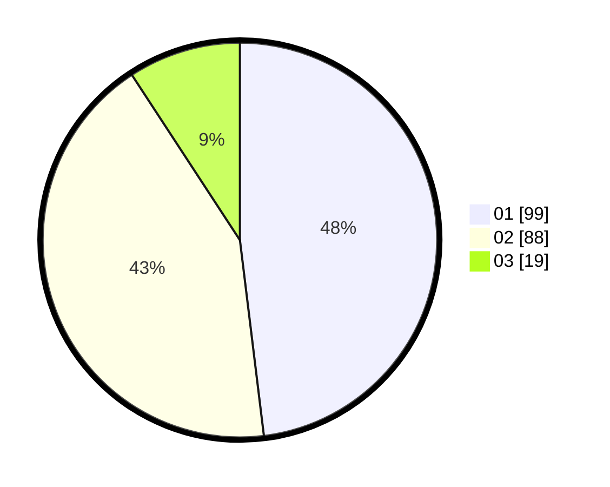

# Hasil

Hasil perolehan suara paslon dapat dilihat pada file paslon-01.txt, paslon-02.txt, dan paslon-03.txt.

Jika tidak ada, artinya data tersebut belum ada pada SIREKAP.

## Perolehan Suara

 * Paslon 01: **99**.
 * Paslon 02: **88**.
 * Paslon 03: **19**.

## Foto C Plano

https://sirekap-obj-formc.kpu.go.id/3858/pemilu/ppwp/31/73/06/10/02/3173061002207-20240214-195620--ae879709-ef6e-403c-bbda-35ecd7ae68ee.jpg

https://sirekap-obj-formc.kpu.go.id/3858/pemilu/ppwp/31/73/06/10/02/3173061002207-20240214-193916--15d7ef0e-0bf6-4c00-b451-0ee15faad39c.jpg

https://sirekap-obj-formc.kpu.go.id/3858/pemilu/ppwp/31/73/06/10/02/3173061002207-20240214-185213--93d3d8ab-7bca-4baa-9151-c89fdd143232.jpg

## DATA PEMILIH TETAP

Jumlah pemilih dalam DPT: **282**.
 * L: **142**.
 * P: **140**.

## DATA PENGGUNA HAK PILIH

Jumlah pengguna hak pilih dalam DPT: **207**.
 * L: **95**.
 * P: **112**.

Jumlah pengguna hak pilih dalam DPTb: **0**.
 * L: **0**.
 * P: **0**.

Jumlah pengguna hak pilih dalam DPK: **3**.
 * L: **2**.
 * P: **1**.

Jumlah pengguna hak pilih: **210**.
 * L: **97**.
 * P: **113**.

## JUMLAH SUARA SAH DAN TIDAK SAH

JUMLAH SELURUH SUARA SAH: **206**.

JUMLAH SUARA TIDAK SAH: **4**.

JUMLAH SELURUH SUARA SAH DAN SUARA TIDAK SAH: **210**.
