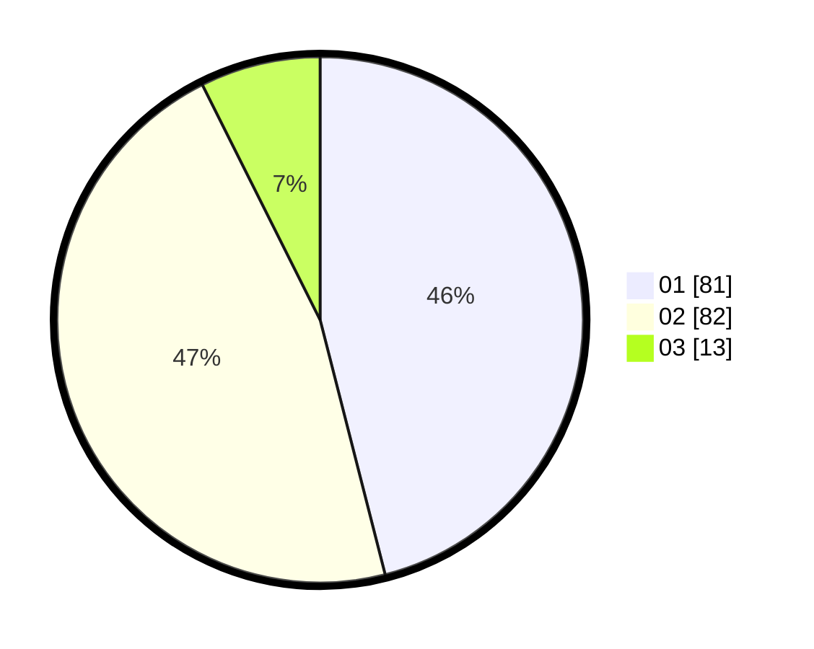

# Hasil

Hasil perolehan suara paslon dapat dilihat pada file paslon-01.txt, paslon-02.txt, dan paslon-03.txt.

Jika tidak ada, artinya data tersebut belum ada pada SIREKAP.

## Perolehan Suara

 * Paslon 01: **81**.
 * Paslon 02: **82**.
 * Paslon 03: **13**.

## Foto C Plano

https://sirekap-obj-formc.kpu.go.id/62b1/pemilu/ppwp/31/73/06/10/02/3173061002210-20240216-053142--46ce649e-88bc-4591-bfe2-c9d511a56f81.jpg

https://sirekap-obj-formc.kpu.go.id/62b1/pemilu/ppwp/31/73/06/10/02/3173061002210-20240214-210805--063031e5-fed3-4139-8573-56f139f19272.jpg

https://sirekap-obj-formc.kpu.go.id/62b1/pemilu/ppwp/31/73/06/10/02/3173061002210-20240214-210936--9d37529f-2ed3-4bf0-bcfe-abcac9b63ff8.jpg

## DATA PEMILIH TETAP

Jumlah pemilih dalam DPT: **263**.
 * L: **128**.
 * P: **135**.

## DATA PENGGUNA HAK PILIH

Jumlah pengguna hak pilih dalam DPT: **179**.
 * L: **81**.
 * P: **98**.

Jumlah pengguna hak pilih dalam DPTb: **0**.
 * L: **0**.
 * P: **0**.

Jumlah pengguna hak pilih dalam DPK: **0**.
 * L: **0**.
 * P: **0**.

Jumlah pengguna hak pilih: **179**.
 * L: **81**.
 * P: **98**.

## JUMLAH SUARA SAH DAN TIDAK SAH

JUMLAH SELURUH SUARA SAH: **176**.

JUMLAH SUARA TIDAK SAH: **3**.

JUMLAH SELURUH SUARA SAH DAN SUARA TIDAK SAH: **179**.
