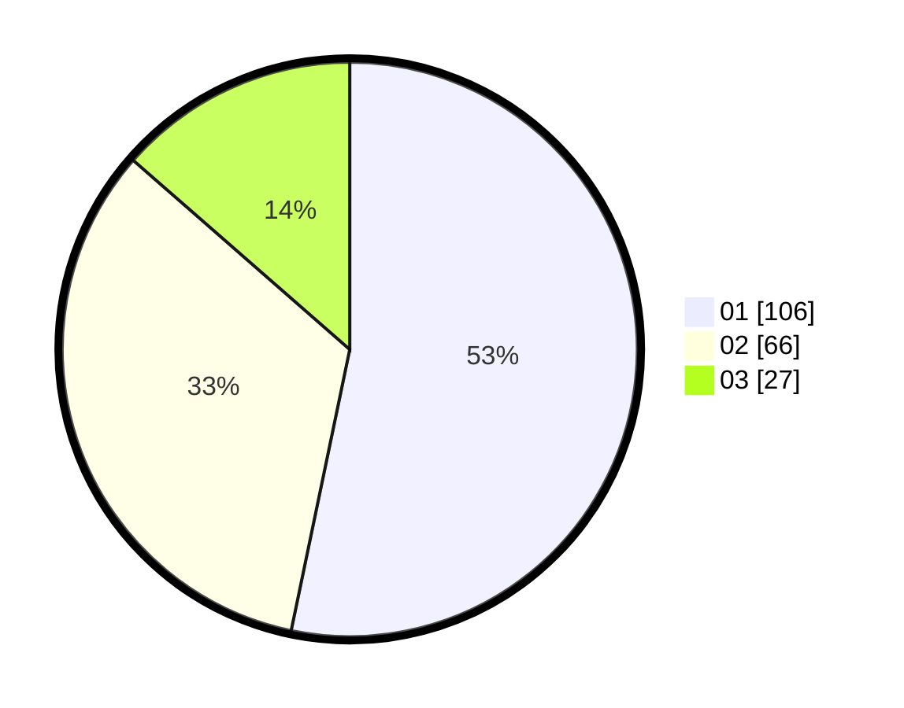

# Hasil

Hasil perolehan suara paslon dapat dilihat pada file paslon-01.txt, paslon-02.txt, dan paslon-03.txt.

Jika tidak ada, artinya data tersebut belum ada pada SIREKAP.

## Perolehan Suara

 * Paslon 01: **106**.
 * Paslon 02: **66**.
 * Paslon 03: **27**.

## Foto C Plano

https://sirekap-obj-formc.kpu.go.id/e774/pemilu/ppwp/31/73/06/10/02/3173061002211-20240215-221148--eb8c81ab-b5b5-4571-aed9-82bf37be261a.jpg

https://sirekap-obj-formc.kpu.go.id/e774/pemilu/ppwp/31/73/06/10/02/3173061002211-20240215-221151--4f1bc477-c3f3-4718-ae70-947a13a3f3e2.jpg

https://sirekap-obj-formc.kpu.go.id/e774/pemilu/ppwp/31/73/06/10/02/3173061002211-20240215-221150--e519a395-5cb7-4c61-9f08-3a7758d70aa9.jpg

## DATA PEMILIH TETAP

Jumlah pemilih dalam DPT: **254**.
 * L: **125**.
 * P: **129**.

## DATA PENGGUNA HAK PILIH

Jumlah pengguna hak pilih dalam DPT: **200**.
 * L: **93**.
 * P: **107**.

Jumlah pengguna hak pilih dalam DPTb: **1**.
 * L: **1**.
 * P: **0**.

Jumlah pengguna hak pilih dalam DPK: **2**.
 * L: **1**.
 * P: **1**.

Jumlah pengguna hak pilih: **203**.
 * L: **95**.
 * P: **108**.

## JUMLAH SUARA SAH DAN TIDAK SAH

JUMLAH SELURUH SUARA SAH: **199**.

JUMLAH SUARA TIDAK SAH: **4**.

JUMLAH SELURUH SUARA SAH DAN SUARA TIDAK SAH: **203**.
