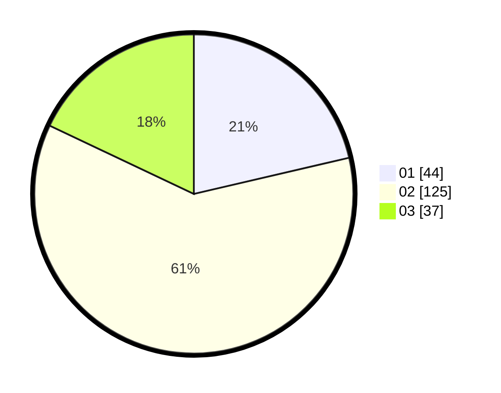

# Hasil

Hasil perolehan suara paslon dapat dilihat pada file paslon-01.txt, paslon-02.txt, dan paslon-03.txt.

Jika tidak ada, artinya data tersebut belum ada pada SIREKAP.

## Perolehan Suara

 * Paslon 01: **44**.
 * Paslon 02: **125**.
 * Paslon 03: **37**.

## Foto C Plano

https://sirekap-obj-formc.kpu.go.id/f1d2/pemilu/ppwp/31/73/06/10/02/3173061002218-20240215-031814--51fc3a4f-eac4-42a3-8a3a-f3120063202d.jpg

https://sirekap-obj-formc.kpu.go.id/f1d2/pemilu/ppwp/31/73/06/10/02/3173061002218-20240215-031826--e3e564a6-df52-47eb-b859-c38b60819045.jpg

https://sirekap-obj-formc.kpu.go.id/f1d2/pemilu/ppwp/31/73/06/10/02/3173061002218-20240215-031833--b19b37ec-d585-4009-b343-c40768b8caab.jpg
