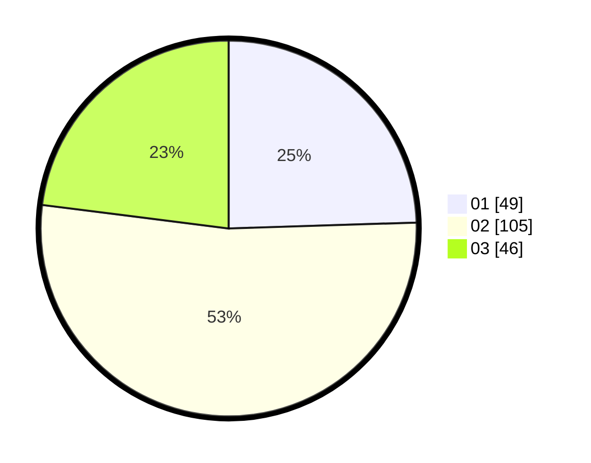

# Hasil

Hasil perolehan suara paslon dapat dilihat pada file paslon-01.txt, paslon-02.txt, dan paslon-03.txt.

Jika tidak ada, artinya data tersebut belum ada pada SIREKAP.

## Perolehan Suara

 * Paslon 01: **49**.
 * Paslon 02: **105**.
 * Paslon 03: **46**.

## Foto C Plano

https://sirekap-obj-formc.kpu.go.id/c16f/pemilu/ppwp/31/73/06/10/02/3173061002222-20240214-212610--6b8d96aa-4b40-44b7-af38-a7c0febe41dd.jpg

https://sirekap-obj-formc.kpu.go.id/c16f/pemilu/ppwp/31/73/06/10/02/3173061002222-20240214-195032--1d081902-1e9b-4be6-aba2-31da593d5669.jpg

https://sirekap-obj-formc.kpu.go.id/c16f/pemilu/ppwp/31/73/06/10/02/3173061002222-20240214-195948--69ec1fac-b3f2-4200-8ba2-a26f55ebe0fa.jpg
