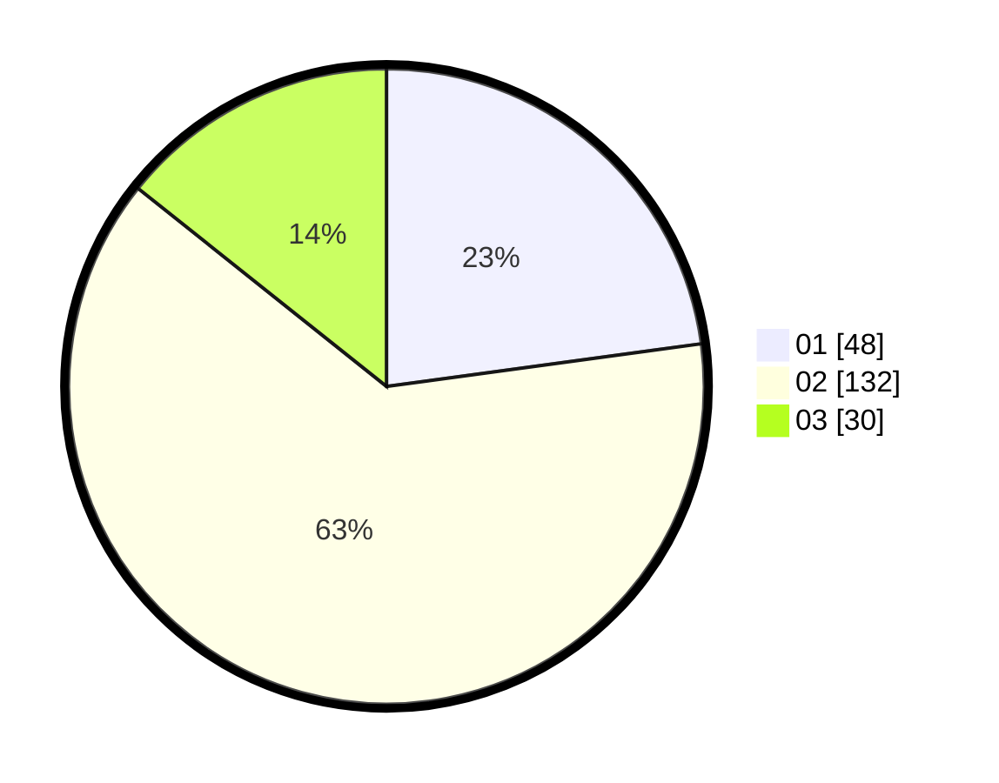

# Hasil

Hasil perolehan suara paslon dapat dilihat pada file paslon-01.txt, paslon-02.txt, dan paslon-03.txt.

Jika tidak ada, artinya data tersebut belum ada pada SIREKAP.

## Perolehan Suara

 * Paslon 01: **48**.
 * Paslon 02: **132**.
 * Paslon 03: **30**.

## Foto C Plano

https://sirekap-obj-formc.kpu.go.id/5a33/pemilu/ppwp/31/73/06/10/02/3173061002224-20240216-001215--abcf30a5-7477-4be1-ae14-372a66b35552.jpg

https://sirekap-obj-formc.kpu.go.id/5a33/pemilu/ppwp/31/73/06/10/02/3173061002224-20240216-001217--298c0f50-290c-45b0-b938-66fb15e8d3c1.jpg

https://sirekap-obj-formc.kpu.go.id/5a33/pemilu/ppwp/31/73/06/10/02/3173061002224-20240216-033857--b8693411-2da9-42cd-a48b-efe2e53c4b53.jpg

## DATA PEMILIH TETAP

Jumlah pemilih dalam DPT: **269**.
 * L: **135**.
 * P: **134**.

## DATA PENGGUNA HAK PILIH

Jumlah pengguna hak pilih dalam DPT: **215**.
 * L: **97**.
 * P: **118**.

Jumlah pengguna hak pilih dalam DPTb: **2**.
 * L: **2**.
 * P: **0**.

Jumlah pengguna hak pilih dalam DPK: **0**.
 * L: **0**.
 * P: **0**.

Jumlah pengguna hak pilih: **217**.
 * L: **99**.
 * P: **118**.

## JUMLAH SUARA SAH DAN TIDAK SAH

JUMLAH SELURUH SUARA SAH: **210**.

JUMLAH SUARA TIDAK SAH: **5**.

JUMLAH SELURUH SUARA SAH DAN SUARA TIDAK SAH: **215**.
