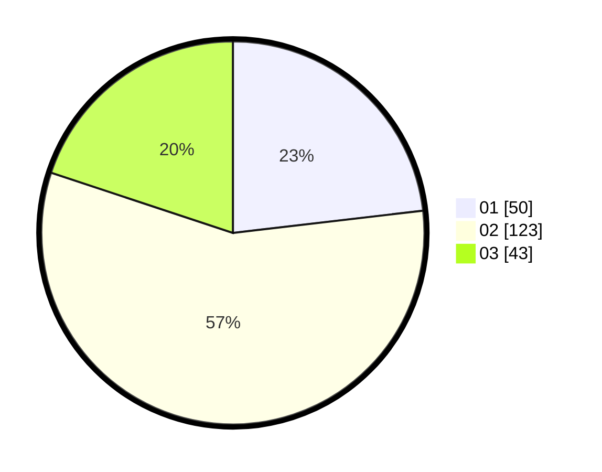

# Hasil

Hasil perolehan suara paslon dapat dilihat pada file paslon-01.txt, paslon-02.txt, dan paslon-03.txt.

Jika tidak ada, artinya data tersebut belum ada pada SIREKAP.

## Perolehan Suara

 * Paslon 01: **50**.
 * Paslon 02: **123**.
 * Paslon 03: **43**.

## Foto C Plano

https://sirekap-obj-formc.kpu.go.id/92e3/pemilu/ppwp/31/73/06/10/02/3173061002230-20240216-210002--08f7d693-5e35-4cdd-9019-a7e0b05488a2.jpg

https://sirekap-obj-formc.kpu.go.id/92e3/pemilu/ppwp/31/73/06/10/02/3173061002230-20240216-210004--25a148fc-91be-4622-baef-fee607e994d5.jpg

https://sirekap-obj-formc.kpu.go.id/92e3/pemilu/ppwp/31/73/06/10/02/3173061002230-20240216-210003--0dece129-1350-48ed-b915-7ce80a552bcd.jpg

## DATA PEMILIH TETAP

Jumlah pemilih dalam DPT: **277**.
 * L: **135**.
 * P: **142**.

## DATA PENGGUNA HAK PILIH

Jumlah pengguna hak pilih dalam DPT: **216**.
 * L: **99**.
 * P: **117**.

Jumlah pengguna hak pilih dalam DPTb: **1**.
 * L: **1**.
 * P: **0**.

Jumlah pengguna hak pilih dalam DPK: **2**.
 * L: **2**.
 * P: **0**.

Jumlah pengguna hak pilih: **219**.
 * L: **102**.
 * P: **117**.

## JUMLAH SUARA SAH DAN TIDAK SAH

JUMLAH SELURUH SUARA SAH: **216**.

JUMLAH SUARA TIDAK SAH: **3**.

JUMLAH SELURUH SUARA SAH DAN SUARA TIDAK SAH: **219**.
