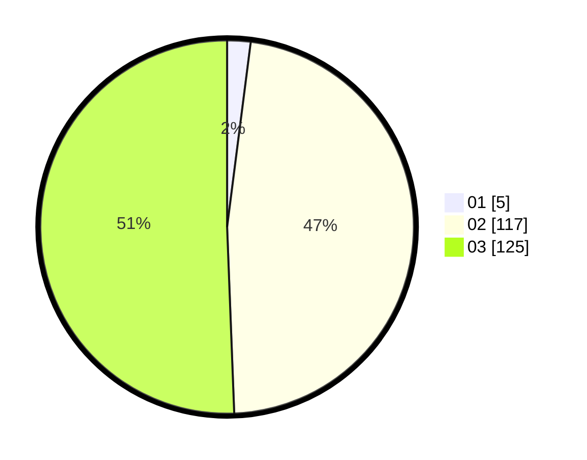

# Hasil

Hasil perolehan suara paslon dapat dilihat pada file paslon-01.txt, paslon-02.txt, dan paslon-03.txt.

Jika tidak ada, artinya data tersebut belum ada pada SIREKAP.

## Perolehan Suara

 * Paslon 01: **5**.
 * Paslon 02: **117**.
 * Paslon 03: **125**.

## Foto C Plano

https://sirekap-obj-formc.kpu.go.id/82a2/pemilu/ppwp/31/73/06/10/02/3173061002231-20240216-015057--653abb9e-b2af-415d-b2a3-d96860f53b45.jpg

https://sirekap-obj-formc.kpu.go.id/82a2/pemilu/ppwp/31/73/06/10/02/3173061002231-20240216-015059--b2383b6c-1239-40f7-acd9-1ceeddd975fe.jpg

https://sirekap-obj-formc.kpu.go.id/82a2/pemilu/ppwp/31/73/06/10/02/3173061002231-20240216-015058--7625195c-670c-4061-8ea2-d6f1f01b7777.jpg

## DATA PEMILIH TETAP

Jumlah pemilih dalam DPT: **287**.
 * L: **139**.
 * P: **148**.

## DATA PENGGUNA HAK PILIH

Jumlah pengguna hak pilih dalam DPT: **239**.
 * L: **117**.
 * P: **122**.

Jumlah pengguna hak pilih dalam DPTb: **7**.
 * L: **2**.
 * P: **5**.

Jumlah pengguna hak pilih dalam DPK: **2**.
 * L: **0**.
 * P: **2**.

Jumlah pengguna hak pilih: **248**.
 * L: **119**.
 * P: **129**.

## JUMLAH SUARA SAH DAN TIDAK SAH

JUMLAH SELURUH SUARA SAH: **247**.

JUMLAH SUARA TIDAK SAH: **1**.

JUMLAH SELURUH SUARA SAH DAN SUARA TIDAK SAH: **248**.
