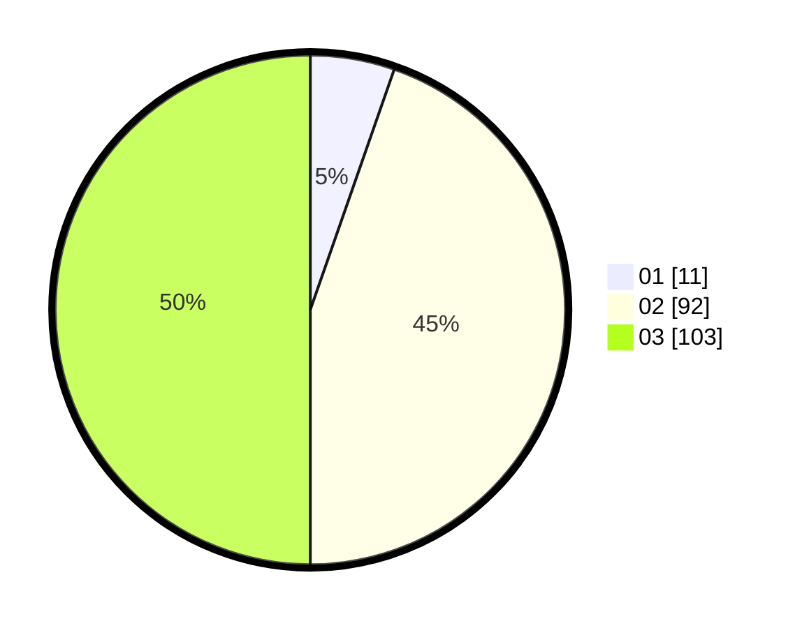

# Hasil

Hasil perolehan suara paslon dapat dilihat pada file paslon-01.txt, paslon-02.txt, dan paslon-03.txt.

Jika tidak ada, artinya data tersebut belum ada pada SIREKAP.

## Perolehan Suara

 * Paslon 01: **11**.
 * Paslon 02: **92**.
 * Paslon 03: **103**.

## Foto C Plano

https://sirekap-obj-formc.kpu.go.id/890b/pemilu/ppwp/31/73/06/10/02/3173061002232-20240214-225441--653ca27c-099a-4ab9-9f41-6e7603cde11d.jpg

https://sirekap-obj-formc.kpu.go.id/890b/pemilu/ppwp/31/73/06/10/02/3173061002232-20240214-225504--9ff863ae-4266-44d3-a1c6-70015cdcb0d7.jpg

https://sirekap-obj-formc.kpu.go.id/890b/pemilu/ppwp/31/73/06/10/02/3173061002232-20240214-225523--7bfd0765-1fc5-42e6-a6ad-b76f87e83271.jpg
