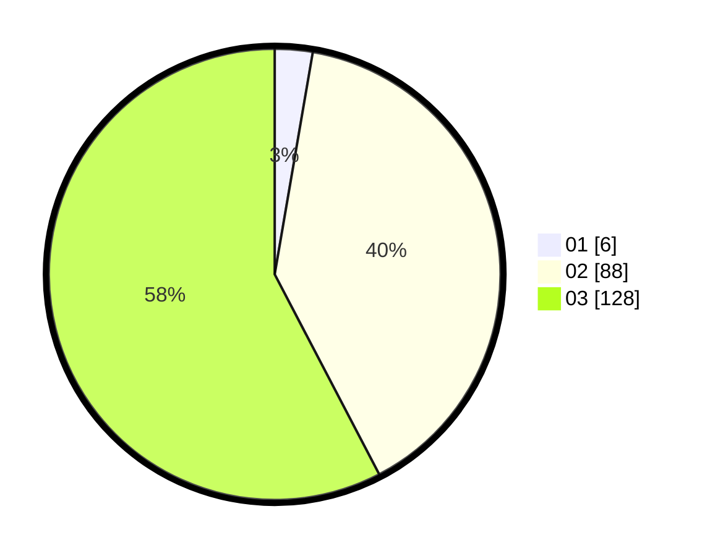

# Hasil

Hasil perolehan suara paslon dapat dilihat pada file paslon-01.txt, paslon-02.txt, dan paslon-03.txt.

Jika tidak ada, artinya data tersebut belum ada pada SIREKAP.

## Perolehan Suara

 * Paslon 01: **6**.
 * Paslon 02: **88**.
 * Paslon 03: **128**.

## Foto C Plano

https://sirekap-obj-formc.kpu.go.id/5587/pemilu/ppwp/31/73/06/10/02/3173061002234-20240215-220430--7240fcc2-4368-447b-8679-aab3bef03032.jpg

https://sirekap-obj-formc.kpu.go.id/5587/pemilu/ppwp/31/73/06/10/02/3173061002234-20240215-220431--b09cc61f-e73c-4b71-acba-a68bdc8d8b64.jpg

https://sirekap-obj-formc.kpu.go.id/5587/pemilu/ppwp/31/73/06/10/02/3173061002234-20240215-220430--4515bd20-d098-4814-abff-54728b5d6c4f.jpg

## DATA PEMILIH TETAP

Jumlah pemilih dalam DPT: **286**.
 * L: **140**.
 * P: **146**.

## DATA PENGGUNA HAK PILIH

Jumlah pengguna hak pilih dalam DPT: **219**.
 * L: **107**.
 * P: **112**.

Jumlah pengguna hak pilih dalam DPTb: **7**.
 * L: **5**.
 * P: **2**.

Jumlah pengguna hak pilih dalam DPK: **0**.
 * L: **0**.
 * P: **0**.

Jumlah pengguna hak pilih: **226**.
 * L: **112**.
 * P: **114**.

## JUMLAH SUARA SAH DAN TIDAK SAH

JUMLAH SELURUH SUARA SAH: **222**.

JUMLAH SUARA TIDAK SAH: **4**.

JUMLAH SELURUH SUARA SAH DAN SUARA TIDAK SAH: **226**.
