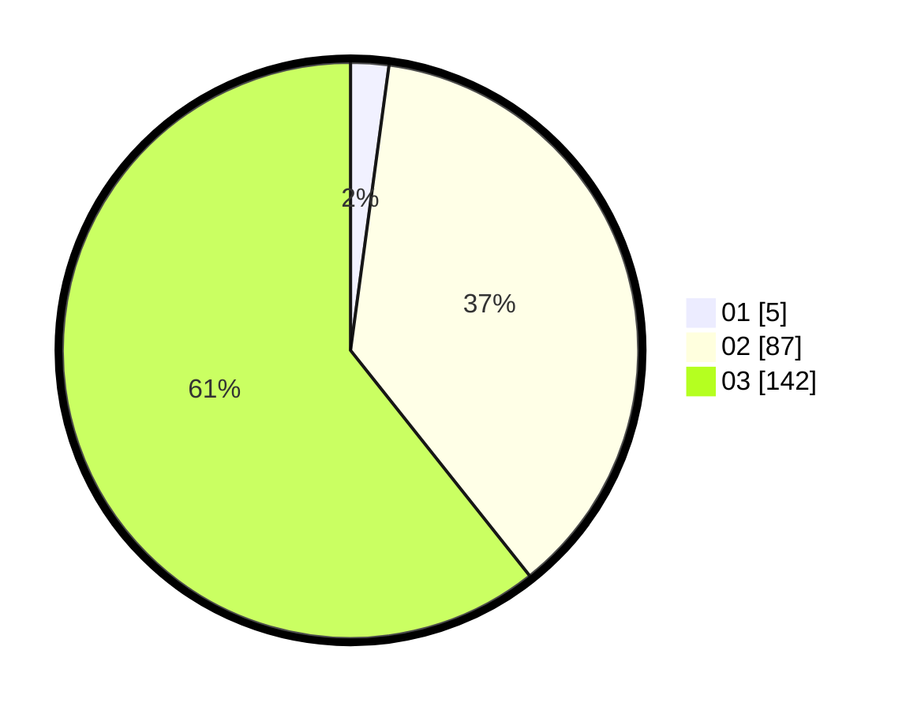

# Hasil

Hasil perolehan suara paslon dapat dilihat pada file paslon-01.txt, paslon-02.txt, dan paslon-03.txt.

Jika tidak ada, artinya data tersebut belum ada pada SIREKAP.

## Perolehan Suara

 * Paslon 01: **5**.
 * Paslon 02: **87**.
 * Paslon 03: **142**.

## Foto C Plano

https://sirekap-obj-formc.kpu.go.id/097c/pemilu/ppwp/31/73/06/10/02/3173061002238-20240215-214141--99d3a2c0-c33f-4c06-b791-e2cae8c61b3c.jpg

https://sirekap-obj-formc.kpu.go.id/097c/pemilu/ppwp/31/73/06/10/02/3173061002238-20240215-214143--1fc51fd1-9cf5-4fd4-b330-8858d78444ea.jpg

https://sirekap-obj-formc.kpu.go.id/097c/pemilu/ppwp/31/73/06/10/02/3173061002238-20240215-214142--11942636-a3e6-4e12-85d7-c8aa48a55114.jpg

## DATA PEMILIH TETAP

Jumlah pemilih dalam DPT: **276**.
 * L: **138**.
 * P: **138**.

## DATA PENGGUNA HAK PILIH

Jumlah pengguna hak pilih dalam DPT: **216**.
 * L: **111**.
 * P: **105**.

Jumlah pengguna hak pilih dalam DPTb: **14**.
 * L: **7**.
 * P: **7**.

Jumlah pengguna hak pilih dalam DPK: **6**.
 * L: **2**.
 * P: **4**.

Jumlah pengguna hak pilih: **236**.
 * L: **120**.
 * P: **116**.

## JUMLAH SUARA SAH DAN TIDAK SAH

JUMLAH SELURUH SUARA SAH: **234**.

JUMLAH SUARA TIDAK SAH: **2**.

JUMLAH SELURUH SUARA SAH DAN SUARA TIDAK SAH: **236**.
