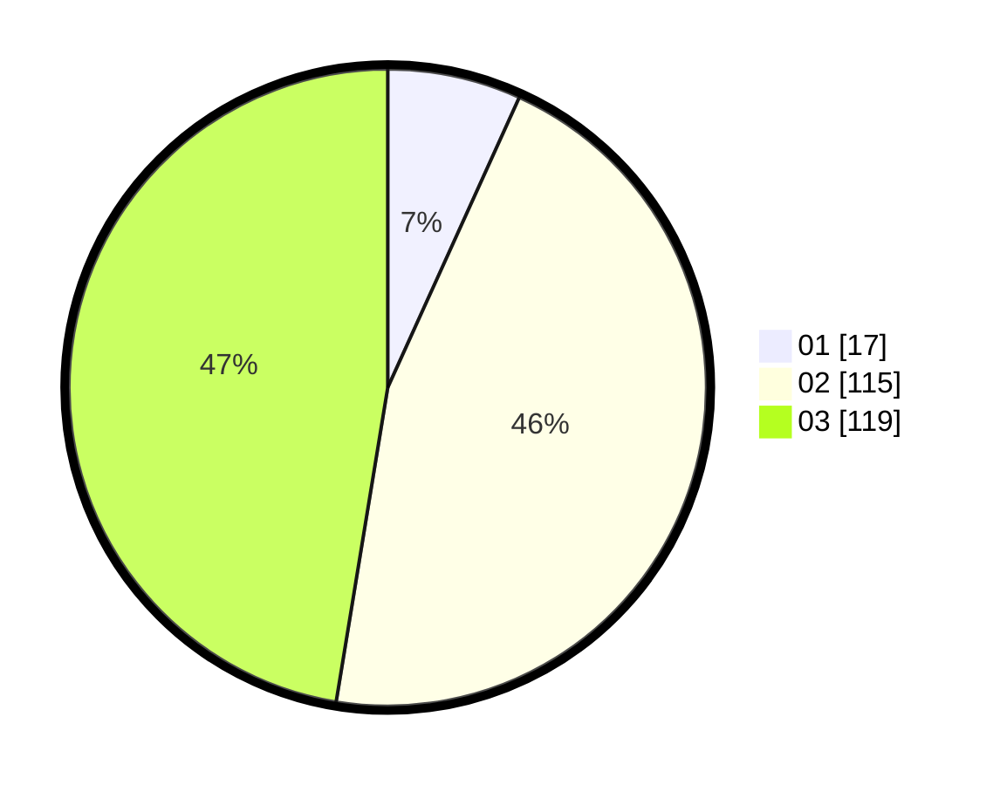

# Hasil

Hasil perolehan suara paslon dapat dilihat pada file paslon-01.txt, paslon-02.txt, dan paslon-03.txt.

Jika tidak ada, artinya data tersebut belum ada pada SIREKAP.

## Perolehan Suara

 * Paslon 01: **17**.
 * Paslon 02: **115**.
 * Paslon 03: **119**.

## Foto C Plano

https://sirekap-obj-formc.kpu.go.id/48ab/pemilu/ppwp/31/73/06/10/02/3173061002240-20240214-155639--1c8ea55d-2a64-48ae-8770-82587c65f978.jpg

https://sirekap-obj-formc.kpu.go.id/48ab/pemilu/ppwp/31/73/06/10/02/3173061002240-20240214-160109--4315a8c2-01a6-41f2-af16-9bc0f36965c8.jpg
