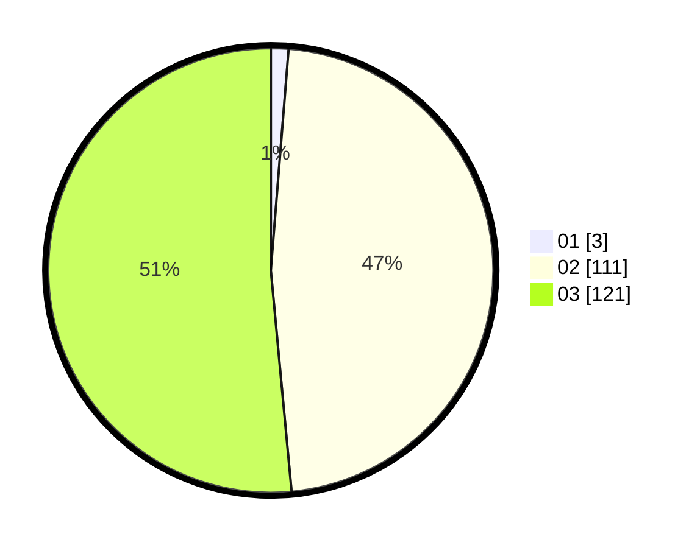

# Hasil

Hasil perolehan suara paslon dapat dilihat pada file paslon-01.txt, paslon-02.txt, dan paslon-03.txt.

Jika tidak ada, artinya data tersebut belum ada pada SIREKAP.

## Perolehan Suara

 * Paslon 01: **3**.
 * Paslon 02: **111**.
 * Paslon 03: **121**.

## Foto C Plano

https://sirekap-obj-formc.kpu.go.id/f329/pemilu/ppwp/31/73/06/10/02/3173061002244-20240216-020124--c179531d-9a69-4abf-9687-548782427e49.jpg

https://sirekap-obj-formc.kpu.go.id/f329/pemilu/ppwp/31/73/06/10/02/3173061002244-20240216-020125--d6f243fd-bf8a-4b98-8a22-acd4131dc3b4.jpg

https://sirekap-obj-formc.kpu.go.id/f329/pemilu/ppwp/31/73/06/10/02/3173061002244-20240216-020125--f6a9bd7f-f61f-49aa-9c77-645b9889dd94.jpg

## DATA PEMILIH TETAP

Jumlah pemilih dalam DPT: **270**.
 * L: **119**.
 * P: **151**.

## DATA PENGGUNA HAK PILIH

Jumlah pengguna hak pilih dalam DPT: **224**.
 * L: **100**.
 * P: **124**.

Jumlah pengguna hak pilih dalam DPTb: **5**.
 * L: **3**.
 * P: **2**.

Jumlah pengguna hak pilih dalam DPK: **7**.
 * L: **3**.
 * P: **4**.

Jumlah pengguna hak pilih: **236**.
 * L: **106**.
 * P: **130**.

## JUMLAH SUARA SAH DAN TIDAK SAH

JUMLAH SELURUH SUARA SAH: **235**.

JUMLAH SUARA TIDAK SAH: **1**.

JUMLAH SELURUH SUARA SAH DAN SUARA TIDAK SAH: **236**.
