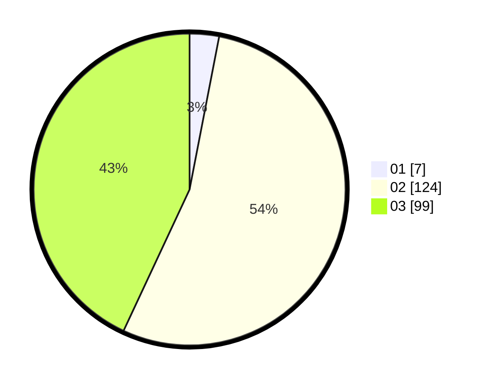

# Hasil

Hasil perolehan suara paslon dapat dilihat pada file paslon-01.txt, paslon-02.txt, dan paslon-03.txt.

Jika tidak ada, artinya data tersebut belum ada pada SIREKAP.

## Perolehan Suara

 * Paslon 01: **7**.
 * Paslon 02: **124**.
 * Paslon 03: **99**.

## Foto C Plano

https://sirekap-obj-formc.kpu.go.id/471b/pemilu/ppwp/31/73/06/10/02/3173061002245-20240217-204503--ee43575b-c040-4c8a-a737-17983957b31d.jpg

https://sirekap-obj-formc.kpu.go.id/471b/pemilu/ppwp/31/73/06/10/02/3173061002245-20240217-204504--2777a2f7-d892-4a55-89f7-d7da66247f19.jpg

https://sirekap-obj-formc.kpu.go.id/471b/pemilu/ppwp/31/73/06/10/02/3173061002245-20240217-204504--b783835e-e6d3-461a-a6aa-ff6cdba79ebb.jpg

## DATA PEMILIH TETAP

Jumlah pemilih dalam DPT: **259**.
 * L: **117**.
 * P: **142**.

## DATA PENGGUNA HAK PILIH

Jumlah pengguna hak pilih dalam DPT: **208**.
 * L: **97**.
 * P: **111**.

Jumlah pengguna hak pilih dalam DPTb: **15**.
 * L: **2**.
 * P: **13**.

Jumlah pengguna hak pilih dalam DPK: **9**.
 * L: **3**.
 * P: **6**.

Jumlah pengguna hak pilih: **232**.
 * L: **102**.
 * P: **130**.

## JUMLAH SUARA SAH DAN TIDAK SAH

JUMLAH SELURUH SUARA SAH: **230**.

JUMLAH SUARA TIDAK SAH: **2**.

JUMLAH SELURUH SUARA SAH DAN SUARA TIDAK SAH: **232**.
