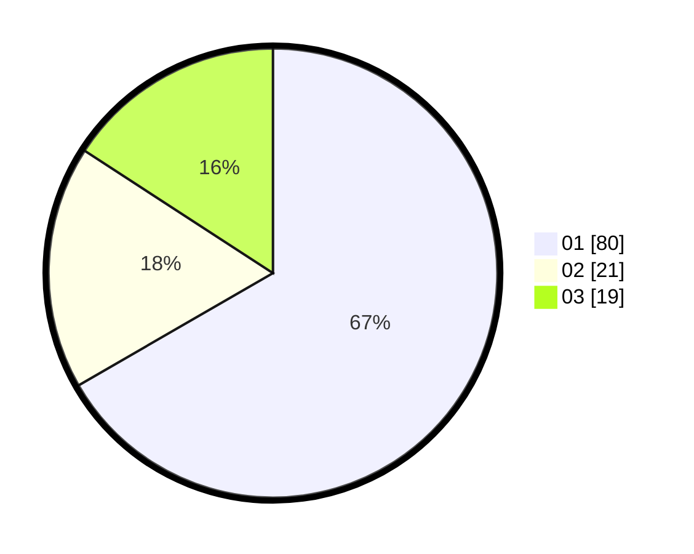

# Hasil

Hasil perolehan suara paslon dapat dilihat pada file paslon-01.txt, paslon-02.txt, dan paslon-03.txt.

Jika tidak ada, artinya data tersebut belum ada pada SIREKAP.

## Perolehan Suara

 * Paslon 01: **80**.
 * Paslon 02: **21**.
 * Paslon 03: **19**.

## Foto C Plano

https://sirekap-obj-formc.kpu.go.id/2f35/pemilu/ppwp/31/73/06/10/03/3173061003006-20240215-011937--991b785c-72bd-4d4c-b26d-8b8b3a60af47.jpg

https://sirekap-obj-formc.kpu.go.id/2f35/pemilu/ppwp/31/73/06/10/03/3173061003006-20240215-061101--05ab2a2e-03d5-4ab7-8406-0e75b62aa4a2.jpg

https://sirekap-obj-formc.kpu.go.id/2f35/pemilu/ppwp/31/73/06/10/03/3173061003006-20240215-061107--5009c97d-dd70-4ad5-a4c0-37a5e65a86ae.jpg

## DATA PEMILIH TETAP

Jumlah pemilih dalam DPT: **273**.
 * L: **141**.
 * P: **132**.

## DATA PENGGUNA HAK PILIH

Jumlah pengguna hak pilih dalam DPT: **220**.
 * L: **111**.
 * P: **109**.

Jumlah pengguna hak pilih dalam DPTb: **0**.
 * L: **0**.
 * P: **0**.

Jumlah pengguna hak pilih dalam DPK: **0**.
 * L: **0**.
 * P: **0**.

Jumlah pengguna hak pilih: **220**.
 * L: **111**.
 * P: **109**.

## JUMLAH SUARA SAH DAN TIDAK SAH

JUMLAH SELURUH SUARA SAH: **220**.

JUMLAH SUARA TIDAK SAH: **0**.

JUMLAH SELURUH SUARA SAH DAN SUARA TIDAK SAH: **220**.
