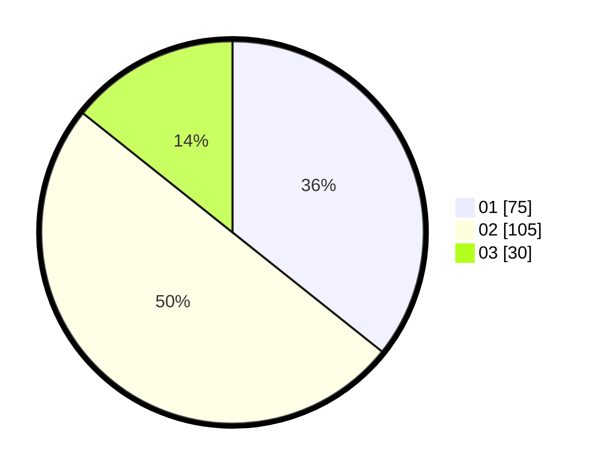

# Hasil

Hasil perolehan suara paslon dapat dilihat pada file paslon-01.txt, paslon-02.txt, dan paslon-03.txt.

Jika tidak ada, artinya data tersebut belum ada pada SIREKAP.

## Perolehan Suara

 * Paslon 01: **75**.
 * Paslon 02: **105**.
 * Paslon 03: **30**.

## Foto C Plano

https://sirekap-obj-formc.kpu.go.id/fe89/pemilu/ppwp/31/73/06/10/03/3173061003008-20240217-175017--7ea105b3-5270-4b10-9b5f-34e5fbdce7e0.jpg

https://sirekap-obj-formc.kpu.go.id/fe89/pemilu/ppwp/31/73/06/10/03/3173061003008-20240217-175018--53d4860e-d54e-461e-b719-665f6a511212.jpg

https://sirekap-obj-formc.kpu.go.id/fe89/pemilu/ppwp/31/73/06/10/03/3173061003008-20240217-175018--736cbc03-759b-4580-a922-aab29036de5b.jpg

## DATA PEMILIH TETAP

Jumlah pemilih dalam DPT: **266**.
 * L: **143**.
 * P: **123**.

## DATA PENGGUNA HAK PILIH

Jumlah pengguna hak pilih dalam DPT: **210**.
 * L: **110**.
 * P: **100**.

Jumlah pengguna hak pilih dalam DPTb: **0**.
 * L: **0**.
 * P: **0**.

Jumlah pengguna hak pilih dalam DPK: **2**.
 * L: **1**.
 * P: **1**.

Jumlah pengguna hak pilih: **212**.
 * L: **111**.
 * P: **101**.

## JUMLAH SUARA SAH DAN TIDAK SAH

JUMLAH SELURUH SUARA SAH: **0**.

JUMLAH SUARA TIDAK SAH: **0**.

JUMLAH SELURUH SUARA SAH DAN SUARA TIDAK SAH: **0**.
