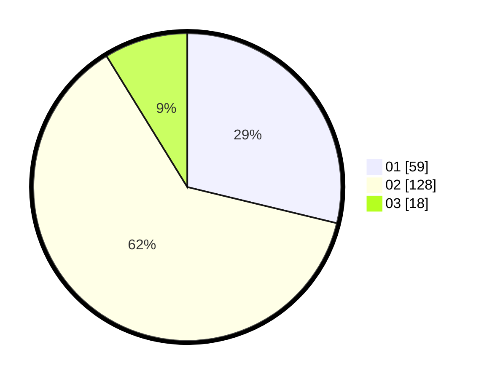

# Hasil

Hasil perolehan suara paslon dapat dilihat pada file paslon-01.txt, paslon-02.txt, dan paslon-03.txt.

Jika tidak ada, artinya data tersebut belum ada pada SIREKAP.

## Perolehan Suara

 * Paslon 01: **59**.
 * Paslon 02: **128**.
 * Paslon 03: **18**.

## Foto C Plano

https://sirekap-obj-formc.kpu.go.id/a7a3/pemilu/ppwp/31/73/06/10/03/3173061003014-20240214-214602--61407708-b050-48b1-b1ac-67f000bf5cbc.jpg

https://sirekap-obj-formc.kpu.go.id/a7a3/pemilu/ppwp/31/73/06/10/03/3173061003014-20240214-214743--8eb9346b-d0a0-4536-90d6-32e665790675.jpg

https://sirekap-obj-formc.kpu.go.id/a7a3/pemilu/ppwp/31/73/06/10/03/3173061003014-20240214-214417--ec2e560e-7ae0-4d28-9c5b-4e6fadb6e923.jpg
