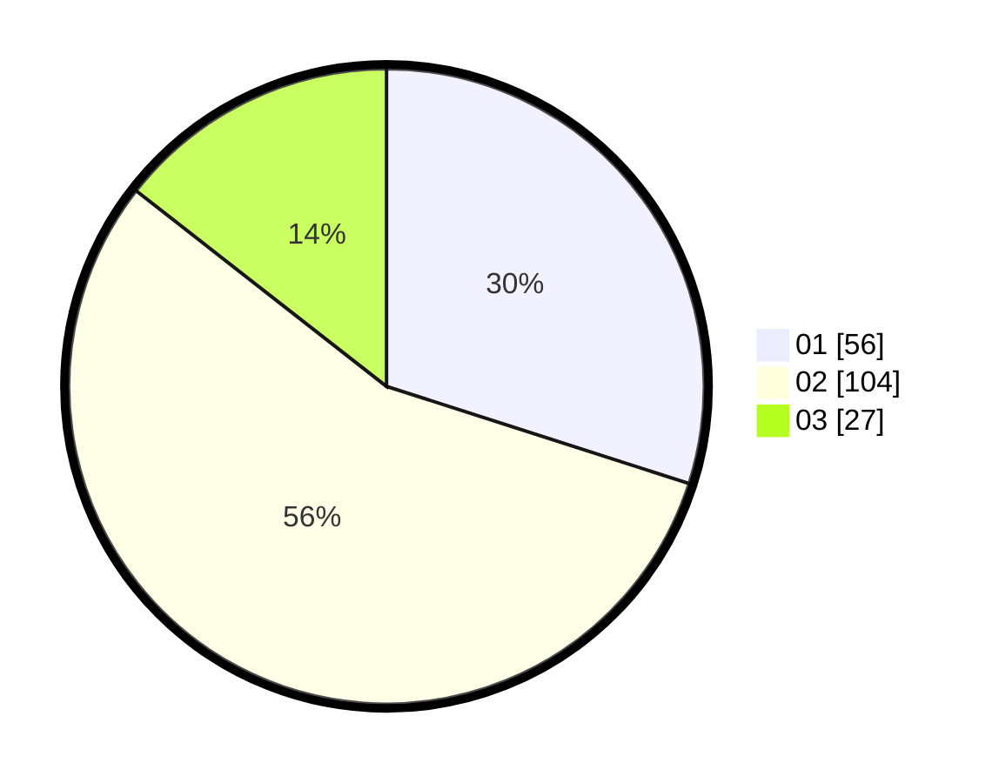

# Hasil

Hasil perolehan suara paslon dapat dilihat pada file paslon-01.txt, paslon-02.txt, dan paslon-03.txt.

Jika tidak ada, artinya data tersebut belum ada pada SIREKAP.

## Perolehan Suara

 * Paslon 01: **56**.
 * Paslon 02: **104**.
 * Paslon 03: **27**.

## Foto C Plano

https://sirekap-obj-formc.kpu.go.id/5709/pemilu/ppwp/31/73/06/10/03/3173061003025-20240214-190127--ab23d017-a29e-4073-804b-e8943debf593.jpg

https://sirekap-obj-formc.kpu.go.id/5709/pemilu/ppwp/31/73/06/10/03/3173061003025-20240214-190252--ad556729-1de4-48bd-82cb-6e37efdabce1.jpg

https://sirekap-obj-formc.kpu.go.id/5709/pemilu/ppwp/31/73/06/10/03/3173061003025-20240214-190445--389193b4-ca49-4518-a4bf-88da759a9ece.jpg

## DATA PEMILIH TETAP

Jumlah pemilih dalam DPT: **269**.
 * L: **138**.
 * P: **131**.

## DATA PENGGUNA HAK PILIH

Jumlah pengguna hak pilih dalam DPT: **189**.
 * L: **94**.
 * P: **95**.

Jumlah pengguna hak pilih dalam DPTb: **0**.
 * L: **0**.
 * P: **0**.

Jumlah pengguna hak pilih dalam DPK: **0**.
 * L: **0**.
 * P: **0**.

Jumlah pengguna hak pilih: **189**.
 * L: **94**.
 * P: **95**.

## JUMLAH SUARA SAH DAN TIDAK SAH

JUMLAH SELURUH SUARA SAH: **187**.

JUMLAH SUARA TIDAK SAH: **2**.

JUMLAH SELURUH SUARA SAH DAN SUARA TIDAK SAH: **189**.
