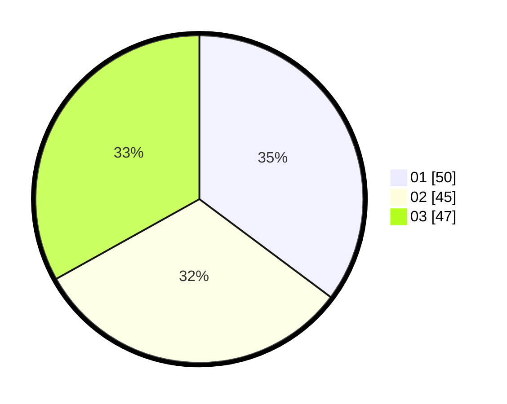

# Hasil

Hasil perolehan suara paslon dapat dilihat pada file paslon-01.txt, paslon-02.txt, dan paslon-03.txt.

Jika tidak ada, artinya data tersebut belum ada pada SIREKAP.

## Perolehan Suara

 * Paslon 01: **50**.
 * Paslon 02: **45**.
 * Paslon 03: **47**.

## Foto C Plano

https://sirekap-obj-formc.kpu.go.id/aa62/pemilu/ppwp/31/73/06/10/03/3173061003026-20240214-190325--2b80e210-2020-4f2d-b80f-c1d110779d2e.jpg

https://sirekap-obj-formc.kpu.go.id/aa62/pemilu/ppwp/31/73/06/10/03/3173061003026-20240214-190535--e535722c-5287-494b-9eda-c76b4e500c6f.jpg

https://sirekap-obj-formc.kpu.go.id/aa62/pemilu/ppwp/31/73/06/10/03/3173061003026-20240214-190852--11edd087-d517-4dfb-968d-72b84094c953.jpg

## DATA PEMILIH TETAP

Jumlah pemilih dalam DPT: **251**.
 * L: **132**.
 * P: **119**.

## DATA PENGGUNA HAK PILIH

Jumlah pengguna hak pilih dalam DPT: **197**.
 * L: **95**.
 * P: **102**.

Jumlah pengguna hak pilih dalam DPTb: **0**.
 * L: **0**.
 * P: **0**.

Jumlah pengguna hak pilih dalam DPK: **0**.
 * L: **0**.
 * P: **0**.

Jumlah pengguna hak pilih: **197**.
 * L: **95**.
 * P: **102**.

## JUMLAH SUARA SAH DAN TIDAK SAH

JUMLAH SELURUH SUARA SAH: **197**.

JUMLAH SUARA TIDAK SAH: **60**.

JUMLAH SELURUH SUARA SAH DAN SUARA TIDAK SAH: **257**.
