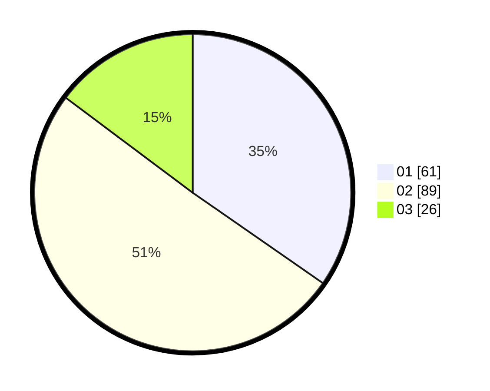

# Hasil

Hasil perolehan suara paslon dapat dilihat pada file paslon-01.txt, paslon-02.txt, dan paslon-03.txt.

Jika tidak ada, artinya data tersebut belum ada pada SIREKAP.

## Perolehan Suara

 * Paslon 01: **61**.
 * Paslon 02: **89**.
 * Paslon 03: **26**.

## Foto C Plano

https://sirekap-obj-formc.kpu.go.id/a13c/pemilu/ppwp/31/73/06/10/03/3173061003028-20240215-215420--81309227-33d9-4e88-87ec-f7ace495da3e.jpg

https://sirekap-obj-formc.kpu.go.id/a13c/pemilu/ppwp/31/73/06/10/03/3173061003028-20240215-215422--3d224b45-c7e7-4535-a3c4-0658dbe8bc3c.jpg

https://sirekap-obj-formc.kpu.go.id/a13c/pemilu/ppwp/31/73/06/10/03/3173061003028-20240215-215421--1db14e42-6158-45f3-a515-08629947f564.jpg

## DATA PEMILIH TETAP

Jumlah pemilih dalam DPT: **0**.
 * L: **0**.
 * P: **0**.

## DATA PENGGUNA HAK PILIH

Jumlah pengguna hak pilih dalam DPT: **0**.
 * L: **0**.
 * P: **0**.

Jumlah pengguna hak pilih dalam DPTb: **0**.
 * L: **0**.
 * P: **0**.

Jumlah pengguna hak pilih dalam DPK: **0**.
 * L: **0**.
 * P: **0**.

Jumlah pengguna hak pilih: **0**.
 * L: **0**.
 * P: **0**.

## JUMLAH SUARA SAH DAN TIDAK SAH

JUMLAH SELURUH SUARA SAH: **176**.

JUMLAH SUARA TIDAK SAH: **3**.

JUMLAH SELURUH SUARA SAH DAN SUARA TIDAK SAH: **179**.
