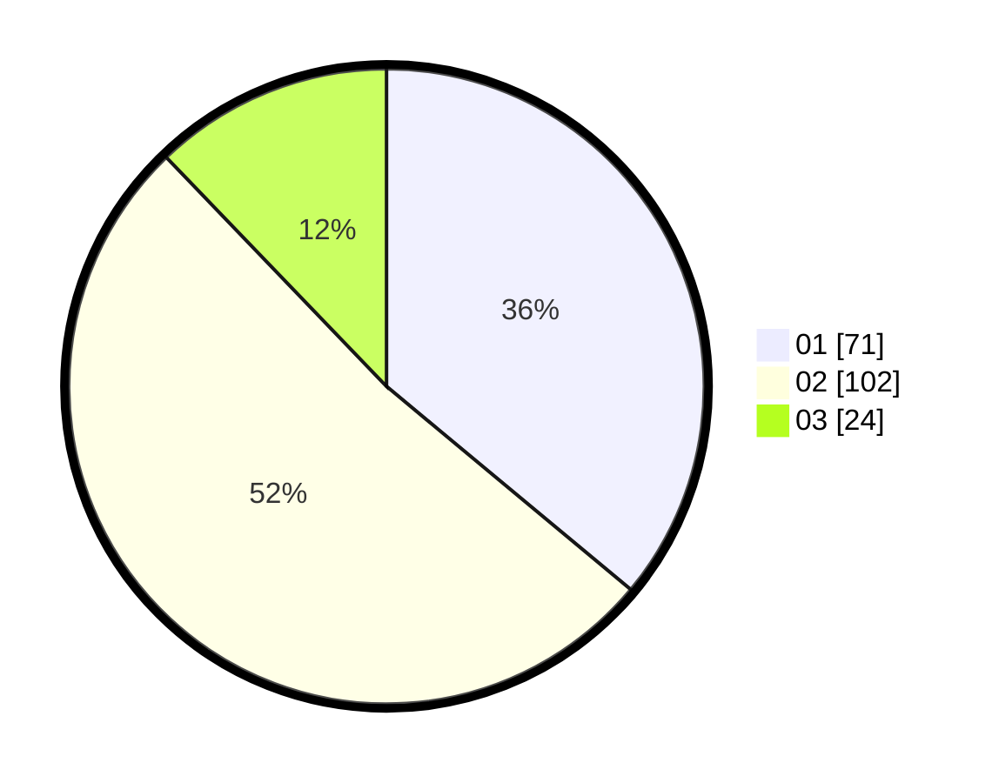

# Hasil

Hasil perolehan suara paslon dapat dilihat pada file paslon-01.txt, paslon-02.txt, dan paslon-03.txt.

Jika tidak ada, artinya data tersebut belum ada pada SIREKAP.

## Perolehan Suara

 * Paslon 01: **71**.
 * Paslon 02: **102**.
 * Paslon 03: **24**.

## Foto C Plano

https://sirekap-obj-formc.kpu.go.id/9854/pemilu/ppwp/31/73/06/10/03/3173061003030-20240214-200253--7dd720e7-8c42-412c-90f1-ef6cf1e95747.jpg

https://sirekap-obj-formc.kpu.go.id/9854/pemilu/ppwp/31/73/06/10/03/3173061003030-20240214-231259--8bda767f-d33f-4b78-b38a-e45f3eea0350.jpg

https://sirekap-obj-formc.kpu.go.id/9854/pemilu/ppwp/31/73/06/10/03/3173061003030-20240214-200358--b43124c2-1cda-436f-a8e8-3da7238f9546.jpg
