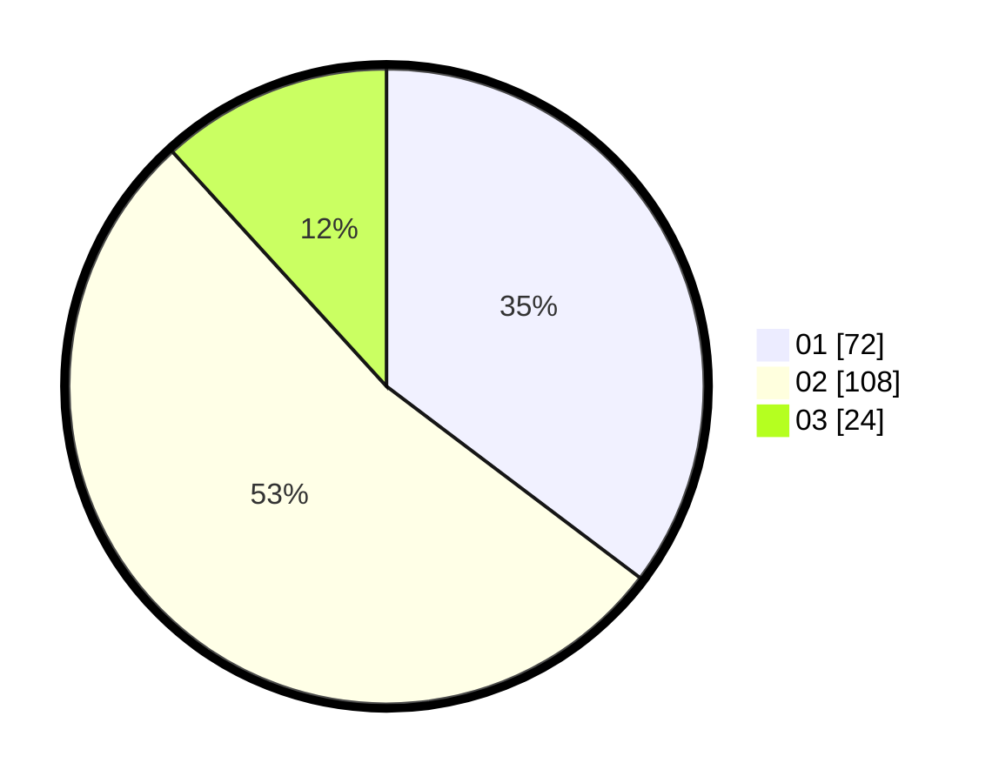

# Hasil

Hasil perolehan suara paslon dapat dilihat pada file paslon-01.txt, paslon-02.txt, dan paslon-03.txt.

Jika tidak ada, artinya data tersebut belum ada pada SIREKAP.

## Perolehan Suara

 * Paslon 01: **72**.
 * Paslon 02: **108**.
 * Paslon 03: **24**.

## Foto C Plano

https://sirekap-obj-formc.kpu.go.id/4cf5/pemilu/ppwp/31/73/06/10/03/3173061003031-20240215-012359--23a2254a-5496-4a4c-b391-e22faf005c1b.jpg

https://sirekap-obj-formc.kpu.go.id/4cf5/pemilu/ppwp/31/73/06/10/03/3173061003031-20240215-013443--26d03f8e-bfe8-4ac2-b334-62f30fcc57c9.jpg

https://sirekap-obj-formc.kpu.go.id/4cf5/pemilu/ppwp/31/73/06/10/03/3173061003031-20240215-013729--a4203663-84cc-4f88-bf29-ca0a93c17ba8.jpg
