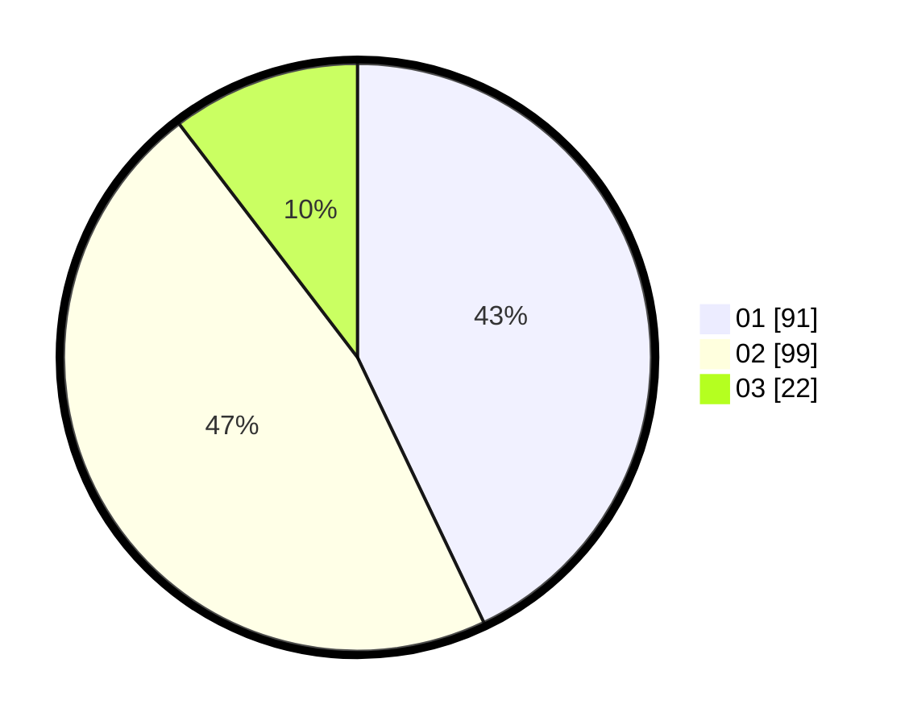

# Hasil

Hasil perolehan suara paslon dapat dilihat pada file paslon-01.txt, paslon-02.txt, dan paslon-03.txt.

Jika tidak ada, artinya data tersebut belum ada pada SIREKAP.

## Perolehan Suara

 * Paslon 01: **91**.
 * Paslon 02: **99**.
 * Paslon 03: **22**.

## Foto C Plano

https://sirekap-obj-formc.kpu.go.id/520c/pemilu/ppwp/31/73/06/10/03/3173061003032-20240215-221048--e402945f-39a4-4609-9cf9-79b6da5c36a5.jpg

https://sirekap-obj-formc.kpu.go.id/520c/pemilu/ppwp/31/73/06/10/03/3173061003032-20240215-221051--23093772-fc3f-40e8-9786-a7079cf953bd.jpg

https://sirekap-obj-formc.kpu.go.id/520c/pemilu/ppwp/31/73/06/10/03/3173061003032-20240215-221050--ac6c60b5-cac6-4ad0-bd1d-a4f3a6a66bb2.jpg

## DATA PEMILIH TETAP

Jumlah pemilih dalam DPT: **293**.
 * L: **153**.
 * P: **140**.

## DATA PENGGUNA HAK PILIH

Jumlah pengguna hak pilih dalam DPT: **217**.
 * L: **108**.
 * P: **109**.

Jumlah pengguna hak pilih dalam DPTb: **0**.
 * L: **0**.
 * P: **0**.

Jumlah pengguna hak pilih dalam DPK: **0**.
 * L: **0**.
 * P: **0**.

Jumlah pengguna hak pilih: **217**.
 * L: **108**.
 * P: **109**.

## JUMLAH SUARA SAH DAN TIDAK SAH

JUMLAH SELURUH SUARA SAH: **212**.

JUMLAH SUARA TIDAK SAH: **5**.

JUMLAH SELURUH SUARA SAH DAN SUARA TIDAK SAH: **217**.
