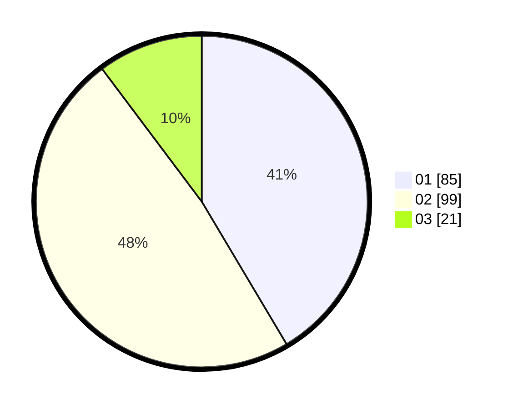

# Hasil

Hasil perolehan suara paslon dapat dilihat pada file paslon-01.txt, paslon-02.txt, dan paslon-03.txt.

Jika tidak ada, artinya data tersebut belum ada pada SIREKAP.

## Perolehan Suara

 * Paslon 01: **85**.
 * Paslon 02: **99**.
 * Paslon 03: **21**.

## Foto C Plano

https://sirekap-obj-formc.kpu.go.id/e7aa/pemilu/ppwp/31/73/06/10/03/3173061003033-20240215-002313--9bda8d17-498d-4af6-b016-ef1ba883c9bc.jpg

https://sirekap-obj-formc.kpu.go.id/e7aa/pemilu/ppwp/31/73/06/10/03/3173061003033-20240215-002425--d2a0f49d-828c-4987-8232-52570f8c5f0d.jpg

https://sirekap-obj-formc.kpu.go.id/e7aa/pemilu/ppwp/31/73/06/10/03/3173061003033-20240215-002511--076c1083-23d3-4586-a36a-60109fd8f24d.jpg
