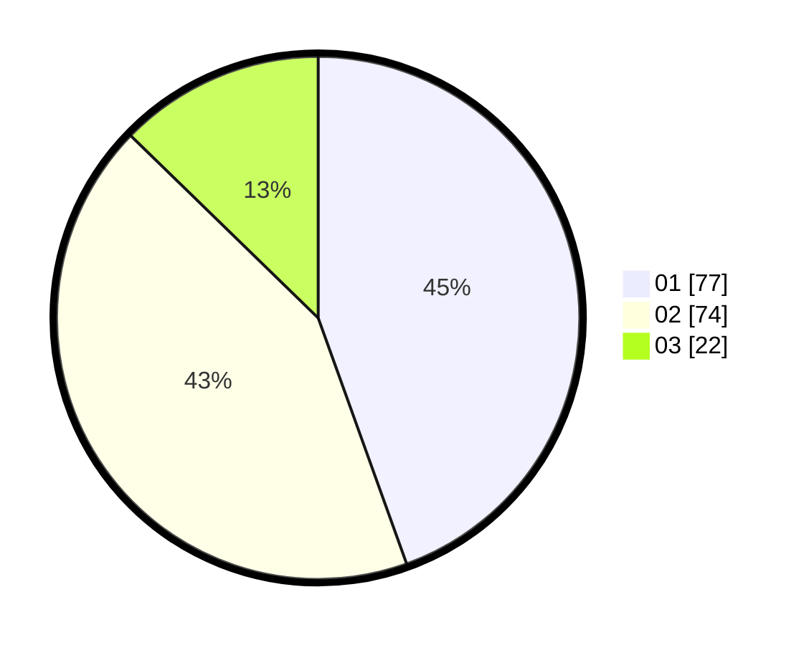

# Hasil

Hasil perolehan suara paslon dapat dilihat pada file paslon-01.txt, paslon-02.txt, dan paslon-03.txt.

Jika tidak ada, artinya data tersebut belum ada pada SIREKAP.

## Perolehan Suara

 * Paslon 01: **77**.
 * Paslon 02: **74**.
 * Paslon 03: **22**.

## Foto C Plano

https://sirekap-obj-formc.kpu.go.id/408b/pemilu/ppwp/31/73/06/10/03/3173061003034-20240214-231939--8b297380-8041-438b-92be-be4a416e8390.jpg

https://sirekap-obj-formc.kpu.go.id/408b/pemilu/ppwp/31/73/06/10/03/3173061003034-20240214-232306--10653289-d898-40d2-b234-a76918009957.jpg

https://sirekap-obj-formc.kpu.go.id/408b/pemilu/ppwp/31/73/06/10/03/3173061003034-20240214-232652--4906a01b-0d3c-44e9-8bcd-82dc4cdfecc8.jpg
