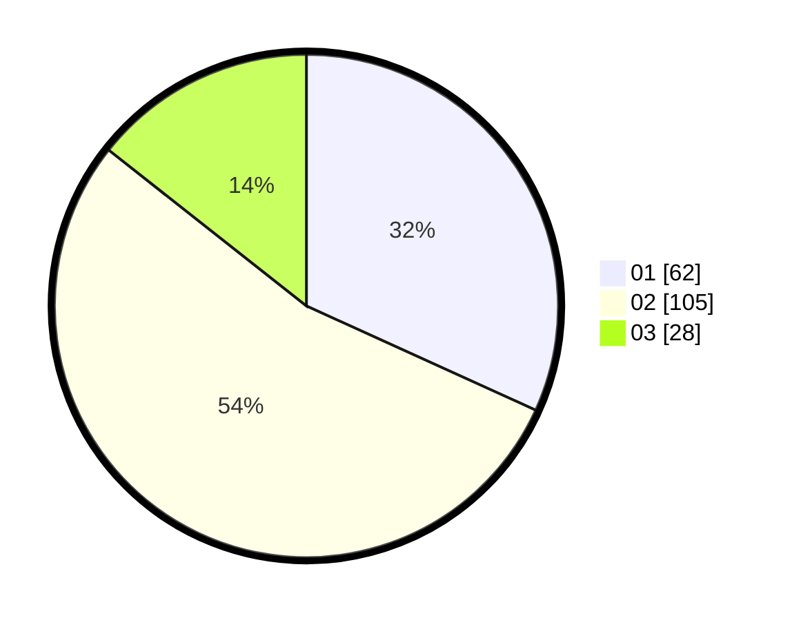

# Hasil

Hasil perolehan suara paslon dapat dilihat pada file paslon-01.txt, paslon-02.txt, dan paslon-03.txt.

Jika tidak ada, artinya data tersebut belum ada pada SIREKAP.

## Perolehan Suara

 * Paslon 01: **62**.
 * Paslon 02: **105**.
 * Paslon 03: **28**.

## Foto C Plano

https://sirekap-obj-formc.kpu.go.id/9d2c/pemilu/ppwp/31/73/06/10/03/3173061003037-20240215-223334--950dade8-0ba2-4fdc-b0d1-79c4e609b24d.jpg

https://sirekap-obj-formc.kpu.go.id/9d2c/pemilu/ppwp/31/73/06/10/03/3173061003037-20240215-223336--17a58c8d-cc1e-4ae3-85d1-f7372e8b6bca.jpg

https://sirekap-obj-formc.kpu.go.id/9d2c/pemilu/ppwp/31/73/06/10/03/3173061003037-20240215-223335--8c916941-c258-468c-80f3-cd65101cc6ae.jpg

## DATA PEMILIH TETAP

Jumlah pemilih dalam DPT: **267**.
 * L: **138**.
 * P: **129**.

## DATA PENGGUNA HAK PILIH

Jumlah pengguna hak pilih dalam DPT: **198**.
 * L: **103**.
 * P: **95**.

Jumlah pengguna hak pilih dalam DPTb: **0**.
 * L: **0**.
 * P: **0**.

Jumlah pengguna hak pilih dalam DPK: **0**.
 * L: **0**.
 * P: **0**.

Jumlah pengguna hak pilih: **198**.
 * L: **103**.
 * P: **95**.

## JUMLAH SUARA SAH DAN TIDAK SAH

JUMLAH SELURUH SUARA SAH: **195**.

JUMLAH SUARA TIDAK SAH: **3**.

JUMLAH SELURUH SUARA SAH DAN SUARA TIDAK SAH: **198**.
