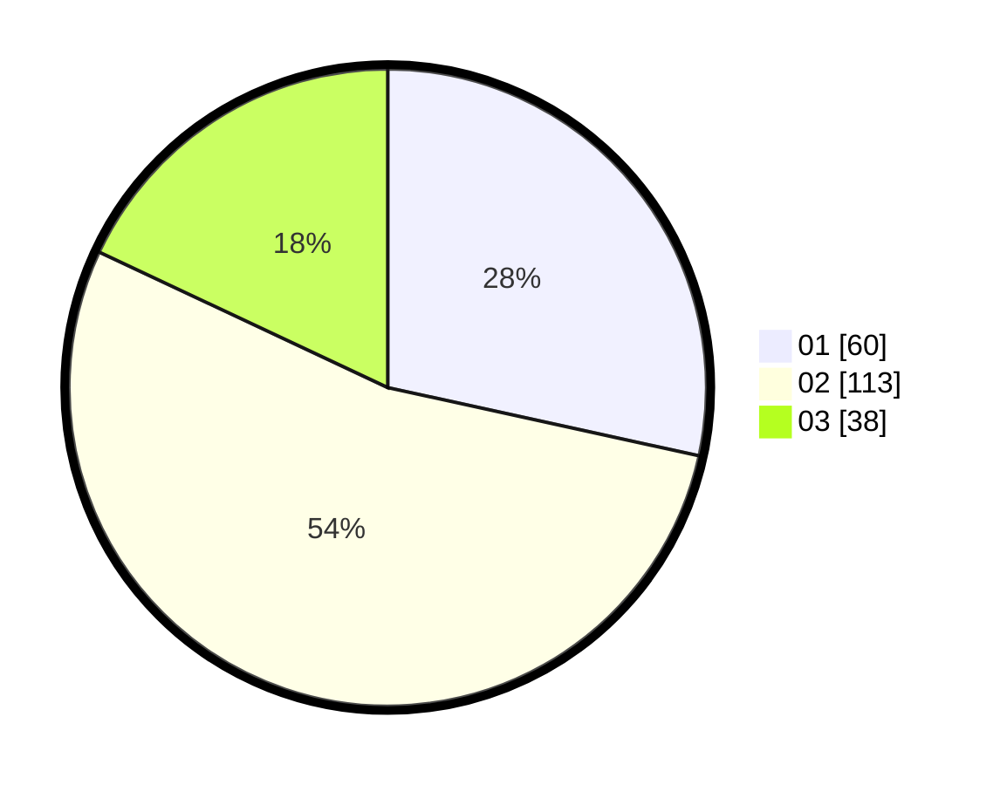

# Hasil

Hasil perolehan suara paslon dapat dilihat pada file paslon-01.txt, paslon-02.txt, dan paslon-03.txt.

Jika tidak ada, artinya data tersebut belum ada pada SIREKAP.

## Perolehan Suara

 * Paslon 01: **60**.
 * Paslon 02: **113**.
 * Paslon 03: **38**.

## Foto C Plano

https://sirekap-obj-formc.kpu.go.id/562c/pemilu/ppwp/31/73/06/10/03/3173061003038-20240214-201126--b262bc01-de35-4d50-a085-28f04d36ef4c.jpg

https://sirekap-obj-formc.kpu.go.id/562c/pemilu/ppwp/31/73/06/10/03/3173061003038-20240216-124409--6487f91e-9f0e-41d9-84f7-8b053e66a9e5.jpg

https://sirekap-obj-formc.kpu.go.id/562c/pemilu/ppwp/31/73/06/10/03/3173061003038-20240214-201507--5c2865c7-d7a4-4e71-beaa-c8e5b27cb648.jpg

## DATA PEMILIH TETAP

Jumlah pemilih dalam DPT: **254**.
 * L: **147**.
 * P: **121**.

## DATA PENGGUNA HAK PILIH

Jumlah pengguna hak pilih dalam DPT: **211**.
 * L: **111**.
 * P: **100**.

Jumlah pengguna hak pilih dalam DPTb: **0**.
 * L: **0**.
 * P: **0**.

Jumlah pengguna hak pilih dalam DPK: **2**.
 * L: **1**.
 * P: **1**.

Jumlah pengguna hak pilih: **213**.
 * L: **112**.
 * P: **101**.

## JUMLAH SUARA SAH DAN TIDAK SAH

JUMLAH SELURUH SUARA SAH: **211**.

JUMLAH SUARA TIDAK SAH: **2**.

JUMLAH SELURUH SUARA SAH DAN SUARA TIDAK SAH: **213**.
