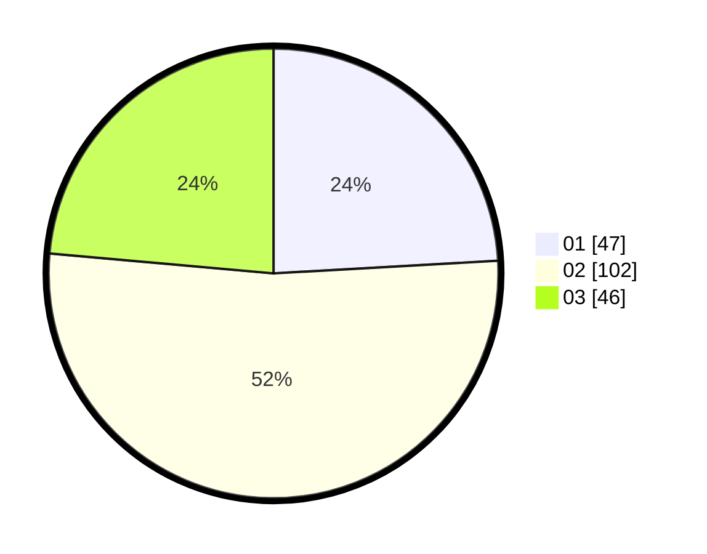

# Hasil

Hasil perolehan suara paslon dapat dilihat pada file paslon-01.txt, paslon-02.txt, dan paslon-03.txt.

Jika tidak ada, artinya data tersebut belum ada pada SIREKAP.

## Perolehan Suara

 * Paslon 01: **47**.
 * Paslon 02: **102**.
 * Paslon 03: **46**.

## Foto C Plano

https://sirekap-obj-formc.kpu.go.id/7c04/pemilu/ppwp/31/73/06/10/03/3173061003040-20240214-210658--9c89cf9e-9548-46e8-86e1-e21cff1ec246.jpg

https://sirekap-obj-formc.kpu.go.id/7c04/pemilu/ppwp/31/73/06/10/03/3173061003040-20240214-210816--39882a2a-b800-4470-a7b5-e0c548d66110.jpg

https://sirekap-obj-formc.kpu.go.id/7c04/pemilu/ppwp/31/73/06/10/03/3173061003040-20240214-203054--ff549a4e-769f-4702-a112-094b8947a7d6.jpg
