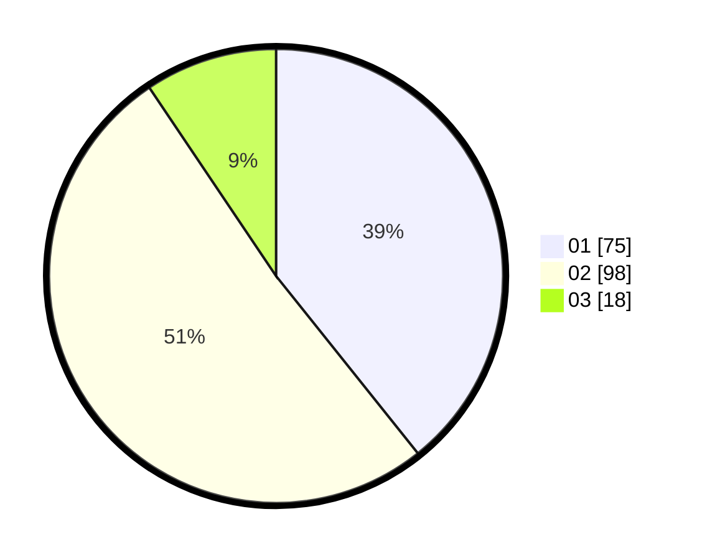

# Hasil

Hasil perolehan suara paslon dapat dilihat pada file paslon-01.txt, paslon-02.txt, dan paslon-03.txt.

Jika tidak ada, artinya data tersebut belum ada pada SIREKAP.

## Perolehan Suara

 * Paslon 01: **75**.
 * Paslon 02: **98**.
 * Paslon 03: **18**.

## Foto C Plano

https://sirekap-obj-formc.kpu.go.id/dfac/pemilu/ppwp/31/73/06/10/03/3173061003044-20240214-205810--88d152c7-aff2-48d5-95b6-fd9ce46bed09.jpg

https://sirekap-obj-formc.kpu.go.id/dfac/pemilu/ppwp/31/73/06/10/03/3173061003044-20240214-205926--e42d9537-8298-4a6a-9df7-8d45bdd6c2c7.jpg

https://sirekap-obj-formc.kpu.go.id/dfac/pemilu/ppwp/31/73/06/10/03/3173061003044-20240214-210009--da55ad27-1f97-48dc-aa43-db2ad5921191.jpg
