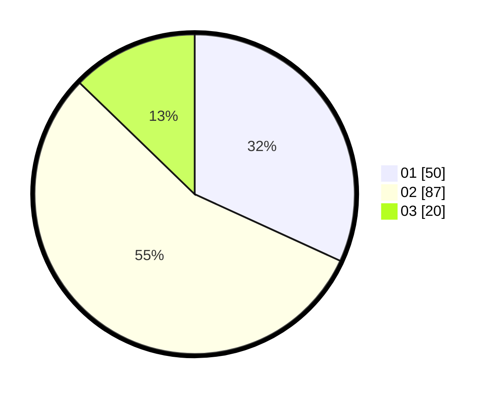

# Hasil

Hasil perolehan suara paslon dapat dilihat pada file paslon-01.txt, paslon-02.txt, dan paslon-03.txt.

Jika tidak ada, artinya data tersebut belum ada pada SIREKAP.

## Perolehan Suara

 * Paslon 01: **50**.
 * Paslon 02: **87**.
 * Paslon 03: **20**.

## Foto C Plano

https://sirekap-obj-formc.kpu.go.id/0aae/pemilu/ppwp/31/73/06/10/03/3173061003046-20240214-203537--33ba46ae-e13b-49b2-8aab-690e05902fab.jpg

https://sirekap-obj-formc.kpu.go.id/0aae/pemilu/ppwp/31/73/06/10/03/3173061003046-20240214-203830--34ddd0fb-8d48-4e15-9807-820634c7889b.jpg

https://sirekap-obj-formc.kpu.go.id/0aae/pemilu/ppwp/31/73/06/10/03/3173061003046-20240214-204050--4adbdeb1-9bf5-4f08-8fe5-1599c16cf847.jpg

## DATA PEMILIH TETAP

Jumlah pemilih dalam DPT: **204**.
 * L: **98**.
 * P: **106**.

## DATA PENGGUNA HAK PILIH

Jumlah pengguna hak pilih dalam DPT: **157**.
 * L: **75**.
 * P: **82**.

Jumlah pengguna hak pilih dalam DPTb: **0**.
 * L: **0**.
 * P: **0**.

Jumlah pengguna hak pilih dalam DPK: **1**.
 * L: **1**.
 * P: **0**.

Jumlah pengguna hak pilih: **158**.
 * L: **76**.
 * P: **82**.

## JUMLAH SUARA SAH DAN TIDAK SAH

JUMLAH SELURUH SUARA SAH: **157**.

JUMLAH SUARA TIDAK SAH: **1**.

JUMLAH SELURUH SUARA SAH DAN SUARA TIDAK SAH: **158**.
