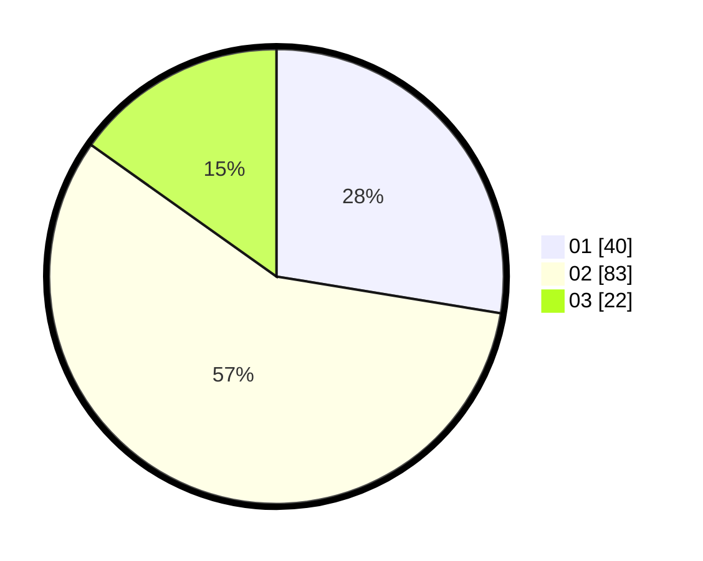

# Hasil

Hasil perolehan suara paslon dapat dilihat pada file paslon-01.txt, paslon-02.txt, dan paslon-03.txt.

Jika tidak ada, artinya data tersebut belum ada pada SIREKAP.

## Perolehan Suara

 * Paslon 01: **40**.
 * Paslon 02: **83**.
 * Paslon 03: **22**.

## Foto C Plano

https://sirekap-obj-formc.kpu.go.id/186b/pemilu/ppwp/31/73/06/10/03/3173061003049-20240214-155045--bea0e410-91b8-4475-b118-4e1d3a6ad5c5.jpg

https://sirekap-obj-formc.kpu.go.id/186b/pemilu/ppwp/31/73/06/10/03/3173061003049-20240214-155108--120c858e-a3ec-4dbd-8d51-c8bce3b79061.jpg

https://sirekap-obj-formc.kpu.go.id/186b/pemilu/ppwp/31/73/06/10/03/3173061003049-20240214-193418--b8ed03b0-93a5-45e5-8680-00a9868e3622.jpg

## DATA PEMILIH TETAP

Jumlah pemilih dalam DPT: **222**.
 * L: **117**.
 * P: **105**.

## DATA PENGGUNA HAK PILIH

Jumlah pengguna hak pilih dalam DPT: **144**.
 * L: **77**.
 * P: **67**.

Jumlah pengguna hak pilih dalam DPTb: **1**.
 * L: **1**.
 * P: **0**.

Jumlah pengguna hak pilih dalam DPK: **4**.
 * L: **2**.
 * P: **2**.

Jumlah pengguna hak pilih: **149**.
 * L: **80**.
 * P: **69**.

## JUMLAH SUARA SAH DAN TIDAK SAH

JUMLAH SELURUH SUARA SAH: **145**.

JUMLAH SUARA TIDAK SAH: **4**.

JUMLAH SELURUH SUARA SAH DAN SUARA TIDAK SAH: **149**.
