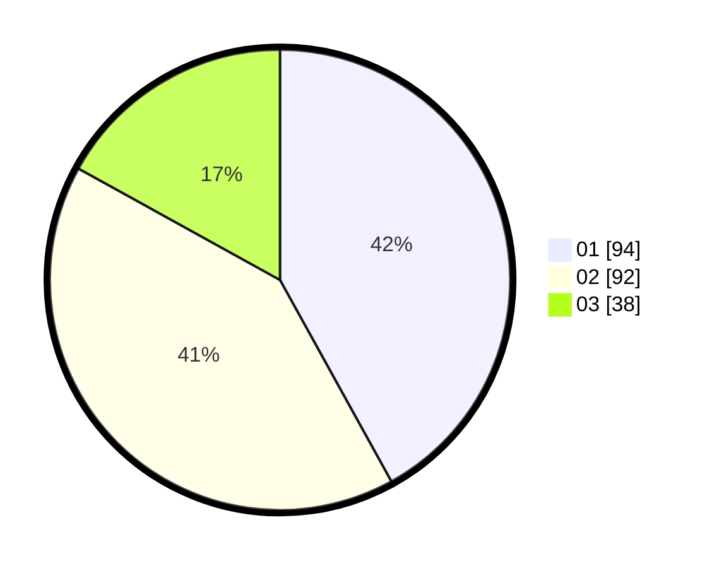

# Hasil

Hasil perolehan suara paslon dapat dilihat pada file paslon-01.txt, paslon-02.txt, dan paslon-03.txt.

Jika tidak ada, artinya data tersebut belum ada pada SIREKAP.

## Perolehan Suara

 * Paslon 01: **94**.
 * Paslon 02: **92**.
 * Paslon 03: **38**.

## Foto C Plano

https://sirekap-obj-formc.kpu.go.id/0af4/pemilu/ppwp/31/73/06/10/03/3173061003050-20240215-053907--6940dc0a-af5f-4616-8823-af9081864ae1.jpg

https://sirekap-obj-formc.kpu.go.id/0af4/pemilu/ppwp/31/73/06/10/03/3173061003050-20240215-054231--ad9c5c65-c3be-40cc-b99c-a299445e2d8d.jpg

https://sirekap-obj-formc.kpu.go.id/0af4/pemilu/ppwp/31/73/06/10/03/3173061003050-20240215-054356--ccd205aa-b95c-408b-b55d-64c028ceace9.jpg
